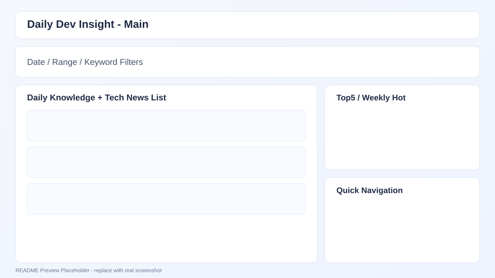
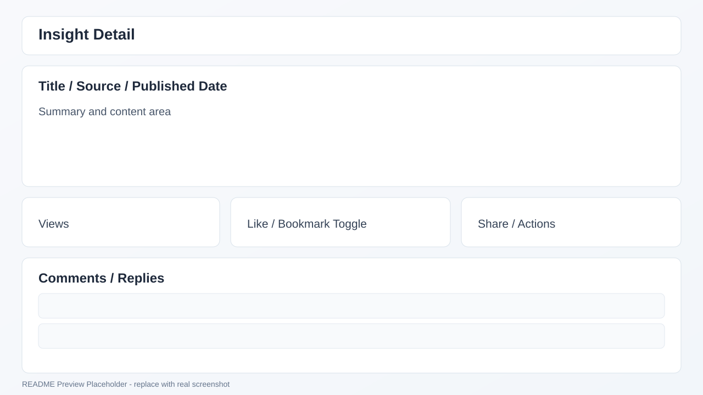
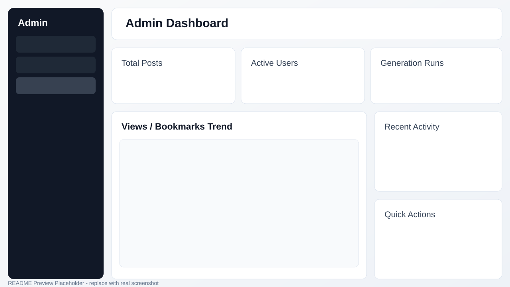

# Daily Dev Insight

Daily Dev Insight는 개발 지식/뉴스를 날짜 기반으로 탐색하고, 사용자 상호작용(조회·좋아요·북마크·댓글)을 제공하는 Spring Boot + Thymeleaf 웹 서비스입니다.  
현재 저장소 기준으로 사용자 영역, 마이페이지, 주간 AI 인사이트, 관리자 운영 기능(콘텐츠/생성/크롤링/통계)이 구현되어 있습니다.

## 1. 기술 스택

- Backend: Java 21, Spring Boot 3.2, Spring MVC, Spring Security, Spring Data JPA
- View: Thymeleaf, Vanilla JS, CSS
- Data: Oracle (ojdbc11), Redis (Spring Cache)
- Crawling: jsoup
- Build/Test: Gradle, JUnit 5

## 2. 핵심 기능

### 사용자 영역
- 메인 페이지: 날짜/기간/키워드/검색타입 기반 인사이트 조회
- 인사이트 상세: 조회수 집계, 좋아요/북마크 토글, 댓글/대댓글 작성 및 삭제
- 콘텐츠 타입 분리: Daily Knowledge / Tech News
- 이번 주 개발 Trend: 최근 7일 뉴스를 AI로 요약한 주간 인사이트(관리자가 공개 처리한 최신 1건만 메인에 노출)

### 인증/권한
- 사용자 로그인: `/login`
- 관리자 로그인: `/admin/login`
- 사용자/관리자 보안 체인 분리 운영

### 마이페이지
- 내 프로필 조회/수정
- 비밀번호 변경
- 활동(좋아요/북마크) 조회
- 회원 탈퇴

### 관리자 영역
- 대시보드: 운영 지표 조회
- 게시글 관리: Daily Knowledge / Tech News 수정·삭제·썸네일 업로드
- 회원 관리: 권한/상태 변경
- 생성 관리: 프롬프트 템플릿, 미리보기, 저장, 실행, 스케줄
- 크롤링 관리: 실행, 조건 프리셋, 스케줄, 이력
- 주간 AI 인사이트 관리: 기준일 지정 생성/재생성, 노출 여부 토글 (크롤링 관리 화면 내)
- 통계: 조회수 / 북마크 통계 화면 분리

## 3. 화면/엔드포인트 요약

### 주요 페이지
- 메인: `/`
- 인사이트 상세: `/insights/{type}/{id}`
- 마이페이지: `/mypage`
- 관리자 대시보드: `/admin/dashboard`
- 관리자 생성 관리: `/admin/generation`
- 관리자 크롤링 관리: `/admin/crawling`

### 주요 API
- `GET /api/insights?date=yyyy-MM-dd`
- `GET /api/insights/{type}/{id}`
- `POST /api/insights/{type}/{id}/likes/toggle`
- `POST /api/insights/{type}/{id}/bookmarks/toggle`
- `POST /api/insights/{type}/{id}/comments`
- `DELETE /api/insights/{type}/{id}/comments/{commentId}`

### 관리자 - 주간 AI 인사이트
- `POST /admin/weekly-insight/generate` (`referenceDate` 옵션, 미지정 시 오늘 기준 최근 7일)
- `POST /admin/weekly-insight/{id}/toggle-visible`

상세 API 계약은 `docs/API_SPEC.md`를 참고하세요.

## 4. 화면 캡처

아래 이미지는 README 프리뷰용 기본 화면입니다. 실제 운영 캡처가 준비되면 동일 파일명으로 교체하세요.

### 메인 화면



### 인사이트 상세 화면



### 관리자 대시보드



## 5. 실행 환경

- JDK 21
- Oracle DB
- Redis
- (선택) Docker / Docker Compose

## 6. 빠른 시작

### 6.1 Oracle 컨테이너 실행 (선택)

프로젝트 루트에서:

```powershell
docker compose up -d
```

- Oracle 포트: `1521`
- Compose 기본 계정: `dailydev / password`

### 6.2 DB 스키마 적용

아래 SQL을 Oracle에서 순서대로 적용하세요.

1. `docs/sql/2026-04-13_insight_engagement_mvp_oracle.sql`
2. `docs/sql/2026-04-15_insight_comment_reply_migration_oracle.sql`
3. `docs/sql/2026-04-15_admin_generation_tables_oracle.sql`
4. `docs/sql/2026-04-15_users_user_id_migration_oracle.sql`
5. `docs/sql/2026-04-15_daily_knowledge_attachment_seed_oracle.sql`
6. `docs/sql/2026-04-15_tech_news_attachment_seed_oracle.sql`
7. `docs/sql/2026-04-16_prompt_template_soft_delete_oracle.sql`
8. `docs/sql/2026-04-17_crawl_management_tables_oracle.sql`
9. `docs/sql/2026-04-17_crawl_management_preset_extension_oracle.sql`
10. `docs/sql/2026-04-23_generation_schedule_duplicate_policy_oracle.sql`

> ※ `weekly_ai_insight` 테이블/시퀀스는 별도 SQL 파일이 없습니다 — 애플리케이션 기동 시 `OracleSchemaMigrationRunner`가 자동 생성합니다.

### 6.3 환경 변수

`backend/src/main/resources/application.yml` 기준 주요 환경 변수:

- `DB_URL` (default: `jdbc:oracle:thin:@//localhost:1521/ORCLPDB`)
- `DB_USERNAME` (default: `daily`)
- `DB_PASSWORD` (default: `1234`)
- `DB_DRIVER` (default: `oracle.jdbc.OracleDriver`)
- `REDIS_HOST` (default: `127.0.0.1`)
- `REDIS_PORT` (default: `6379`)
- `REDIS_TIMEOUT` (default: `3s`)
- `JPA_DDL_AUTO` (default: `none`)
- `LLM_PROVIDER` (default: `openai`)
- `OPENAI_BASE_URL` (default: `https://api.openai.com`)
- `OPENAI_MODEL` (default: `gpt-4.1-mini`)
- `OPENAI_API_KEY`
- `CRAWLER_USER_AGENT` (default: `DailyDevInsightBot/1.0`)
- `CRAWLER_THUMBNAIL_UPLOAD_DIR` (default: `./uploads`)

### 6.4 애플리케이션 실행

```powershell
cd backend
.\gradlew.bat bootRun
```

- 기본 주소: `http://localhost:9090`

## 7. 기본 계정 (개발용)

`docs/sql/2026-04-15_users_user_id_migration_oracle.sql` 기준:

- 사용자: `user01 / 1234`
- 관리자: `admin01 / 1234`

## 8. 테스트

```powershell
cd backend
.\gradlew.bat test
```

## 9. 문서

- API 명세: `docs/API_SPEC.md`
- MVP 범위 및 문서 부채 현황: `docs/MVP_SCOPE.md`
- SQL 스크립트: `docs/sql/`
- 기능별 기획/설계/검증 문서 (PDCA): `docs/01-plan/`(기획) → `docs/02-design/`(기능·화면 설계) → `docs/03-analysis/`(Gap 분석) → `docs/04-report/`(완료 보고서)
  - 전체 페이지/기능 소급 문서화 계획: `docs/01-plan/features/full-documentation-initiative.md`
  - 문서화 과정에서 발견된 코드 이슈 백로그: `docs/03-analysis/full-documentation-initiative-code-findings.md`

## 10. 운영 전 체크 사항

- 현재 `SecurityConfig`는 `NoOpPasswordEncoder`를 사용합니다 — 운영 배포 전 반드시 안전한 비밀번호 인코더(예: BCrypt)로 교체하세요.
- 그 외 알려진 이슈(로그아웃 로직 중복, 캐시 무효화 범위, 고아 엔드포인트 등)는 `docs/03-analysis/full-documentation-initiative-code-findings.md`의 findings 백로그를 참고하세요.
