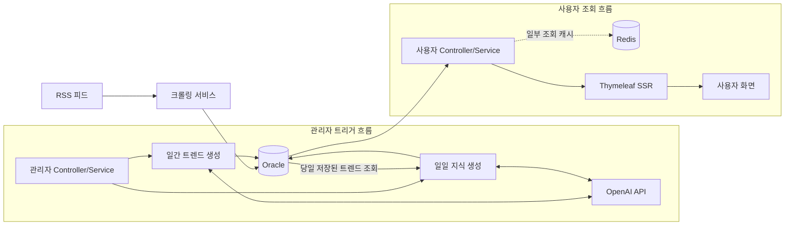
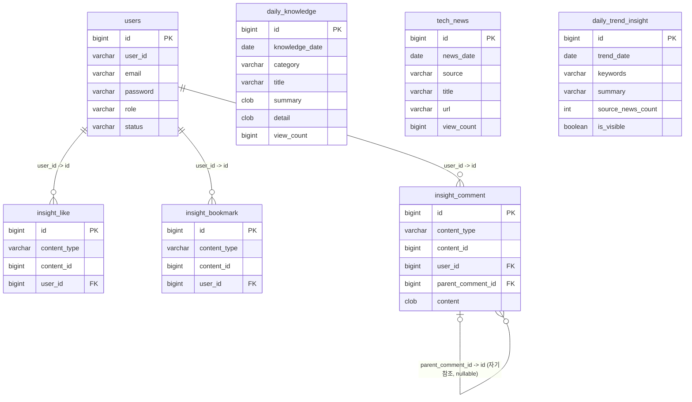
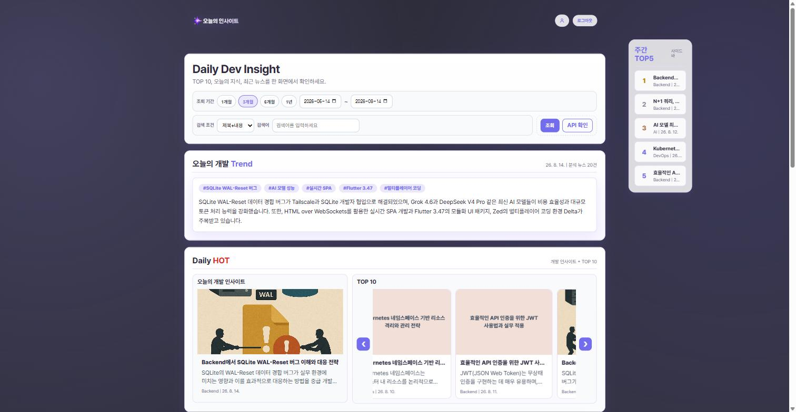
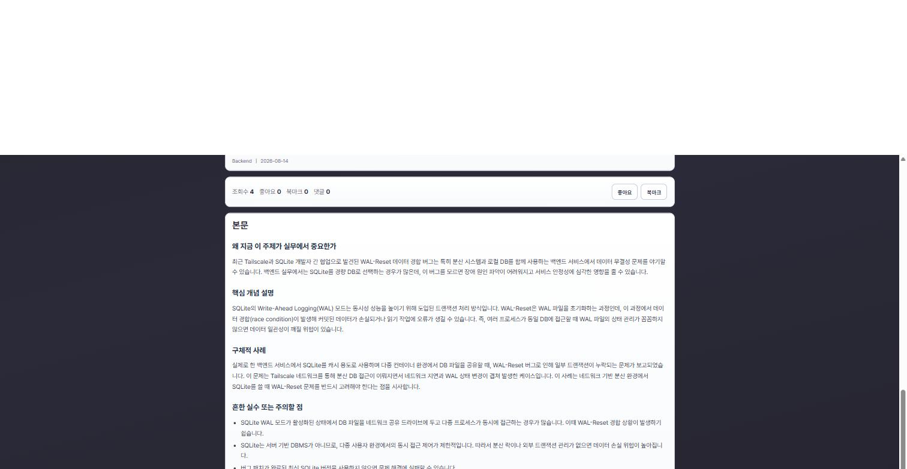
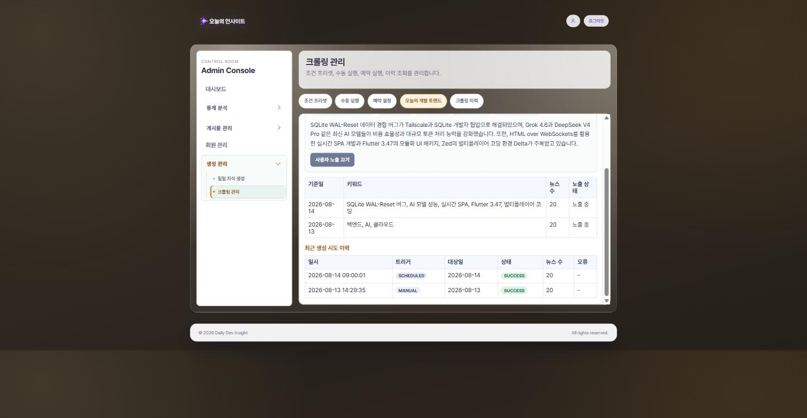

# Daily Dev Insight

RSS로 개발자 뉴스를 수집하고, OpenAI API로 일일 지식과 일간 AI 트렌드를 생성해
관리자 CMS와 사용자 화면에 제공하는 Spring Boot + Thymeleaf 서비스입니다.

- Portfolio: 공개 URL 준비 중
- Live Demo: 준비 중

---

## 1. 프로젝트 소개

개발 관련 뉴스를 매일 자동으로 수집하고, 그 뉴스를 근거로 AI가 오늘의 개발 트렌드와 학습 콘텐츠를 생성해 보여주는 서비스입니다. 빠르게 바뀌는 개발 생태계에서 "오늘 무슨 일이 있었고, 그래서 무엇을 배워야 하는지"를 하나의 흐름으로 연결하는 것이 핵심 목표입니다.

기획(Plan) → 설계(Design) → 구현 → 검증까지 전 과정을 문서로 남기며 개발했고, 일부 기능은 Claude Code가 설계·검증을, Codex CLI가 구현을 맡는 교차검증 파이프라인으로 진행했습니다. 관련 워크플로우: [`docs/01-plan/features/codex-collab-workflow.md`](docs/01-plan/features/codex-collab-workflow.md)

## 2. 주요 기능

### 사용자 영역
- 메인 페이지: 날짜/기간/키워드/검색타입 기반 인사이트 조회
- 인사이트 상세: 조회수 집계, 좋아요/북마크 토글, 댓글/대댓글 작성 및 삭제
- 콘텐츠 타입 분리: Daily Knowledge / Tech News
- **오늘의 개발 트렌드**: 당일(부족 시 최근 3일) 크롤링 뉴스를 AI가 분석해 키워드+요약으로 홈에 노출. 해당 날짜에 트렌드가 정상 생성되어 있으면, 관리자가 프롬프트 템플릿을 수정하지 않아도 서버가 그날의 Daily Knowledge 생성 프롬프트에 자동으로 반영함(트렌드가 없거나 생성 실패 시에는 트렌드 없이 기존 방식으로 생성)

### 인증/권한
- 사용자 로그인: `/login`
- 관리자 로그인: `/admin/login`
- 사용자/관리자 보안 체인 분리 운영 (로그인·정적 리소스 제외 전 경로 인증 필요)

### 마이페이지
- 내 프로필 조회/수정
- 비밀번호 변경
- 활동(좋아요/북마크) 조회
- 회원 탈퇴

### 관리자 영역
- 대시보드: 운영 지표 조회
- 게시글 관리: Daily Knowledge / Tech News 수정·삭제·썸네일 업로드
- 회원 관리: 권한/상태 변경
- 생성 관리: 프롬프트 템플릿 관리, LLM 미리보기, 이미지 재생성, 결과 저장, 생성 스케줄
- 크롤링 관리: 실행, 조건 프리셋, 스케줄, 이력
- 오늘의 개발 트렌드 관리: 기준일 지정 생성/재생성, 노출 여부 토글, 생성 시도 이력(성공/실패) 조회 (크롤링 관리 화면 내)
- 통계: 조회수 / 북마크 통계 화면 분리

## 3. 기술 스택

- Backend: Java 21, Spring Boot 3.2.0, Spring MVC, Spring Security, Spring Data JPA
- View: Thymeleaf, Vanilla JS, CSS
- Data: Oracle XE 21 (ojdbc11), Redis 7 (Spring Cache)
- Crawling: jsoup 1.17.2
- AI: OpenAI API (기본 모델 `gpt-4.1-mini`), Mock 클라이언트로 로컬 개발 지원
- Build/Test: Gradle 8.2, JUnit 5

## 4. 서비스 아키텍처



크롤링된 뉴스가 Oracle에 쌓이면, 관리자 트리거로 일간 트렌드 생성 서비스가 이를 요약해 저장합니다. 일일 지식 생성 서비스는 트렌드 서비스를 직접 호출하는 것이 아니라, 같은 날짜에 저장된 트렌드를 Repository로 다시 조회해 프롬프트에 합칩니다. 사용자 조회 경로 일부에는 Redis 캐시가 적용되며, 관리자 화면은 항상 Controller/Service 계층을 거쳐 DB에 접근합니다(직접 연결 아님). 상세 설계: [`docs/02-design/features/daily-trend-insight.md`](docs/02-design/features/daily-trend-insight.md)

## 5. 핵심 ERD



- `insight_like`/`insight_bookmark`/`insight_comment`의 `user_id → users.id`, `insight_comment`의 자기참조(`parent_comment_id → id`, nullable — 최상위 댓글은 부모 없음)는 실제 Oracle FK 제약으로 존재합니다(JPA `@ManyToOne` 매핑은 사용하지 않고 컬럼만으로 참조).
- `content_type` + `content_id`는 `daily_knowledge` 또는 `tech_news`를 가리키는 **논리적 다형 참조**이며 물리 FK가 아닙니다(애플리케이션 레벨에서 타입 분기 처리).
- `daily_trend_insight`는 다른 테이블과 직접적인 FK 관계가 없습니다. 생성 시점에 `tech_news`를 날짜 조건으로 조회해 참조할 뿐 저장된 연관관계는 없습니다.

## 6. 화면

### 메인 화면


### 인사이트 상세 화면


### 관리자 크롤링 관리 — 오늘의 개발 트렌드


> 위 3장은 로컬 개발용 테스트 계정(§11)으로 로그인해 실제 화면을 캡처한 것입니다. 초기 SVG 프리뷰는 `docs/images/`에 그대로 남아 있습니다. 남은 캡처 우선순위: GIF 1개(선택).

## 7. 주요 기술 개선 이력

짧은 요약만 두고, 상세 내용은 커밋과 설계 문서를 참고하세요.

| 커밋 | 요약 | 관련 문서 |
|---|---|---|
| `73e8a05` | 크롤링 뉴스 분석 기반 "오늘의 개발 트렌드" 추가, 일일 지식 생성 프롬프트에 자동 연동. Plan → Codex 교차검증(2회) → 구현 → 독립 검증(빌드/테스트/실브라우저) 전 과정 진행 | [daily-trend-insight.md](docs/02-design/features/daily-trend-insight.md) |
| `1789bd4` | 크롤링 트랜잭션-외부 I/O 분리, 스케줄러 무한 재시도 수정 | [crawling-transaction-io-separation.md](docs/02-design/features/crawling-transaction-io-separation.md) |
| `76ec0c8` | 크롤링 SSRF/XXE 방어 강화 | [crawling-security-hardening.md](docs/02-design/features/crawling-security-hardening.md) |
| `f9b4124` | `NoOpPasswordEncoder` → BCrypt 마이그레이션 | - |
| `dab3c37` | 관리자/마이페이지 페이지네이션, 통계 캐시, 댓글 조회 인덱스 개선 | - |
| `a9bfc44` | 크롤링 미리보기 경로의 불필요한 `@Transactional` 제거 | - |

## 8. 실행 환경

- JDK 21
- Oracle DB
- Redis
- (선택) Docker / Docker Compose

## 9. 로컬 실행 방법

### 9.1 Oracle·Redis 컨테이너 실행 (선택)

프로젝트 루트에서:

```powershell
docker compose up -d
```

- Oracle 포트: `1521`
- Redis 포트: `6379`
- Compose 기본 계정: `dailydev / password`

### 9.2 DB 스키마 적용

**0단계(필수, 신규 Oracle 인스턴스인 경우)**: 아래 `docs/sql/` 마이그레이션들은 `users`/`daily_knowledge`/`tech_news` 기반 테이블이 이미 존재한다고 가정합니다(예: 1번 파일이 `tech_news`를 `ALTER TABLE`). 이 3개 테이블의 `CREATE TABLE`은 `backend/Query.sql` 5~45행에만 있습니다. 해당 파일을 통째로 실행하지 말고, **5~45행(테이블 3개 생성 + 인덱스)만** 먼저 실행하세요 — 1~3행은 기존 테이블 삭제(`DROP TABLE ... CASCADE CONSTRAINTS`, 신규 DB에서는 오류만 나고 불필요), 47행 이후는 테스트/조회용 샘플 데이터라 스키마 구축에는 필요 없습니다.

그다음 아래 SQL을 Oracle에서 순서대로 적용하세요.

1. `docs/sql/2026-04-13_insight_engagement_mvp_oracle.sql`
2. `docs/sql/2026-04-15_insight_comment_reply_migration_oracle.sql`
3. `docs/sql/2026-04-15_admin_generation_tables_oracle.sql`
4. `docs/sql/2026-04-15_users_user_id_migration_oracle.sql`
5. `docs/sql/2026-04-15_daily_knowledge_attachment_seed_oracle.sql`
6. `docs/sql/2026-04-15_tech_news_attachment_seed_oracle.sql`
7. `docs/sql/2026-04-16_prompt_template_soft_delete_oracle.sql`
8. `docs/sql/2026-04-17_crawl_management_tables_oracle.sql`
9. `docs/sql/2026-04-17_crawl_management_preset_extension_oracle.sql`
10. `docs/sql/2026-04-23_generation_schedule_duplicate_policy_oracle.sql`

> ※ `weekly_ai_insight`, `daily_trend_insight` 등 일부 테이블/시퀀스는 별도 SQL 파일이 없습니다 — 애플리케이션 기동 시 `OracleSchemaMigrationRunner`가 자동 생성합니다.

### 9.3 애플리케이션 실행

```powershell
cd backend
.\gradlew.bat bootRun
```

- 기본 주소: `http://localhost:9090`

## 10. 환경 변수

`backend/src/main/resources/application.yml` 기준 주요 환경 변수:

- `DB_URL` (default: `jdbc:oracle:thin:@//localhost:1521/xepdb1`) — `gvenzl/oracle-xe` 이미지의 PDB 서비스명은 `xepdb1`입니다(`ORCLPDB` 아님)
- `DB_USERNAME` (default: `dailydev`, `docker-compose.yml`의 `APP_USER`와 동일)
- `DB_PASSWORD` (default: `password`, `docker-compose.yml`의 `APP_USER_PASSWORD`와 동일)
- `DB_DRIVER` (default: `oracle.jdbc.OracleDriver`)
- `REDIS_HOST` (default: `127.0.0.1`)
- `REDIS_PORT` (default: `6379`)
- `REDIS_TIMEOUT` (default: `3s`)
- `JPA_DDL_AUTO` (default: `none`)
- `LLM_PROVIDER` (default: `openai`, 로컬 개발 시 `mock`으로 설정하면 OpenAI 키 없이 고정 결과로 동작)
- `OPENAI_BASE_URL` (default: `https://api.openai.com`)
- `OPENAI_MODEL` (default: `gpt-4.1-mini`)
- `OPENAI_API_KEY`
- `CRAWLER_USER_AGENT` (default: `DailyDevInsightBot/1.0`)
- `CRAWLER_THUMBNAIL_UPLOAD_DIR` (default: `./uploads`)

## 11. 개발용 계정

`docs/sql/2026-04-15_users_user_id_migration_oracle.sql` 기준:

- 사용자: `user01 / 1234`
- 관리자: `admin01 / 1234`

## 12. 테스트

```powershell
cd backend
.\gradlew.bat test
```

## 13. 문서

- API 명세: `docs/API_SPEC.md`는 초기 MVP 기준 계약입니다. 현재 전체 API 계약은 `docs/MVP_SCOPE.md`에 기록된 불일치(상세·좋아요·북마크·댓글 API 누락, 인증 요구사항 누락, 뉴스 조회 범위·응답 필드 불일치 등)를 반영해 최신화 예정입니다.
- 구현 범위 문서 부채 현황: `docs/MVP_SCOPE.md` (2026-08-03 스캔 기준 — 일부 항목은 이후 커밋으로 이미 해결되어 최신 코드와 다를 수 있습니다. 예: 뉴스 조회 범위 서술, 비밀번호 인코더 관련 서술)
- SQL 스크립트: `docs/sql/`
- 기능별 기획/설계/검증 문서 (PDCA): `docs/01-plan/`(기획) → `docs/02-design/`(기능·화면 설계) → `docs/03-analysis/`(Gap 분석) → `docs/04-report/`(완료 보고서)
  - 대표 예시(가장 최근, Plan→Design→Codex 교차검증→구현→독립검증까지 진행. Analysis/Report 문서는 아직 별도 작성 전): [daily-trend-insight Plan](docs/01-plan/features/daily-trend-insight.md) / [Design](docs/02-design/features/daily-trend-insight.md)
  - 전체 페이지/기능 소급 문서화 계획: `docs/01-plan/features/full-documentation-initiative.md`
  - 문서화 과정에서 발견된 코드 이슈 백로그: `docs/03-analysis/full-documentation-initiative-code-findings.md`

## 14. Known Issues & Next Steps

- 로그아웃 처리가 `AuthService`와 `MyPageController.processWithdraw()` 두 곳에 중복 구현되어 있습니다.
- AI 콘텐츠 저장과 생성 이력 저장이 하나의 트랜잭션으로 묶여 있지 않습니다.
- 크롤링 중복 방지가 다중 인스턴스 환경을 고려하지 않았습니다. ([crawling-security-hardening.md §4](docs/02-design/features/crawling-security-hardening.md))
- SSRF 방어 적용 후에도 DNS 리바인딩(TOCTOU) 잔여 위험이 남아 있습니다. (위 문서 동일)
- 실제 부하 테스트는 아직 실시하지 않았습니다.
- LLM 호출의 타임아웃/재시도, 프롬프트 인젝션 방어는 아직 구현되지 않았습니다.
- 오늘의 개발 트렌드 수동 생성 저장 시 트렌드 스냅샷이 아닌 참조 ID만 보존되어, 미리보기~저장 사이 트렌드가 재생성되면 근거가 어긋나는 좁은 race window가 있습니다. ([daily-trend-insight.md §13](docs/02-design/features/daily-trend-insight.md))
- 그 외 알려진 이슈는 `docs/03-analysis/full-documentation-initiative-code-findings.md`의 findings 백로그를 참고하세요.
