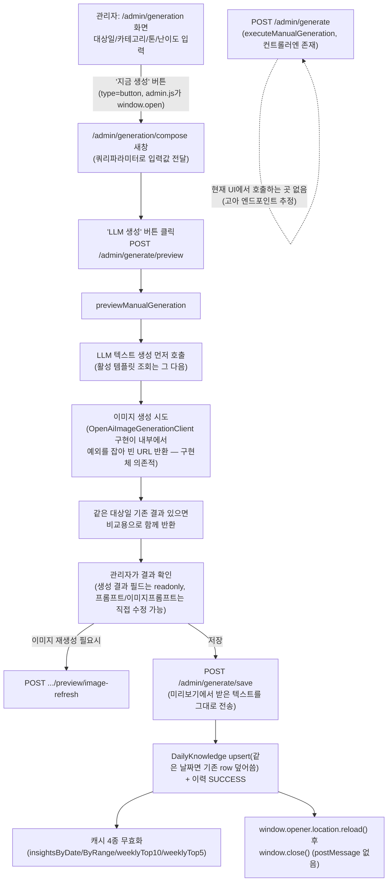

# AI 생성 관리 Design Document

> **Summary**: 관리자가 일일 개발 지식 콘텐츠를 자동(예약)/수동으로 AI 생성하고, 프롬프트 템플릿을 관리하며, 미리보기 후 저장하는 워크플로우
>
> **Project**: dailyDevInsight
> **Date**: 2026-08-06
> **Status**: **Implemented (사후 문서화, 2차 사이클 정밀화)** — SoR: 코드 우선

---

## Context Anchor

| Key | Value |
|-----|-------|
| **WHY** | 일일 개발 지식 콘텐츠를 LLM으로 자동 생성해 운영 부담 절감 |
| **WHO** | 관리자만 |
| **RISK** | 외부 LLM/이미지 API 의존, 두 생성 경로(즉시/미리보기)의 검증 로직 중복 가능성 |
| **SUCCESS** | 예약/즉시/미리보기 3개 경로 모두 정상 동작, 캐시 갱신, 이력 기록 |
| **SCOPE** | 지식 콘텐츠 생성 전체 + 프롬프트 템플릿 관리 |

---

## 1. Overview

### 1.1 목적

`DailyKnowledgeGenerationService`가 LLM 텍스트 생성과 이미지 생성(선택적)을 조합해 일일 지식 콘텐츠를 만든다.

### 1.2 관련 파일

| 레이어 | 파일 |
|--------|------|
| Controller | `AdminPageController`(11개 엔드포인트) |
| Service | `DailyKnowledgeGenerationService`, `PromptTemplateService`, `GenerationScheduleService`, `GenerationHistoryService` |
| 외부 연동 | `LlmGenerationClient`, `ImageGenerationClient`(`ObjectProvider`로 선택 주입) |
| Entity | `PromptTemplate`, `GenerationSchedule`, `GenerationHistory`, `DailyKnowledge` |
| Template/JS | `admin/generation.html`+`admin.js`, `admin/generation-compose.html`+`admin-generation-compose.js` |
| Test | `AdminPageControllerTest`(생성 관련 다수 케이스 포함, CSRF 테스트도 포함) |

---

## 2. Data Model

| Entity | 핵심 필드 | 비고 |
|---|---|---|
| `PromptTemplate` | `templateContent`, `active`(단일 활성 정책 추정) | **[Codex 검증 정정] 저장 단계는 활성 템플릿이 없으면 실패하지만, 미리보기는 LLM 호출을 먼저 하고 그 다음에 활성 템플릿을 조회함 — "생성 자체가 불가능"은 부정확, 정확히는 "저장은 막히지만 미리보기 LLM 호출은 이미 발생할 수 있음"** |
| `GenerationSchedule` | `cronExpression`, `enabled`, `allowDuplicate`, `category`/`tone`/`difficulty`, `lastExecutedAt` | Unit 7 스케줄러가 폴링 |
| `GenerationHistory` | `type`(MANUAL/SCHEDULED), `status`(성공/스킵/실패 구분), `errorCode`, `createdKnowledgeId` | 3가지 결과가 각각 별도 저장 메서드로 기록됨 |

---

## 3. 동작 명세

### 3.1 Endpoints (11개)

| Method | Path | 용도 |
|---|---|---|
| GET | `/admin/generation` | 생성 이력/스케줄/프롬프트 관리 화면 |
| GET | `/admin/generation/compose` | 미리보기 작성 새창(쿼리파라미터로 targetDate/category/tone/difficulty 전달받음) |
| POST | `/admin/prompts` | 프롬프트 템플릿 생성 |
| POST | `/admin/prompts/{id}/activate` | 템플릿 활성화(단일 활성 전환) |
| POST | `/admin/prompts/{id}/toggle-active` | 템플릿 활성/비활성 토글 |
| POST | `/admin/prompts/{id}/delete` | 템플릿 삭제 |
| POST | `/admin/generate` | **[Codex 검증 정정] 컨트롤러 코드는 존재하나, 현재 `admin/generation.html` 화면 어디에도 이 엔드포인트를 호출하는 버튼/폼 submit/JS가 없음 — 사실상 고아(orphaned) 엔드포인트** |
| POST | `/admin/generate/preview` | 미리보기(DB 저장 안 함) |
| POST | `/admin/generate/preview/image-refresh` | 미리보기 이미지만 재생성 |
| POST | `/admin/generate/save` | 미리보기(또는 수정된) 텍스트를 최종 저장 |
| POST | `/admin/schedule` | 자동 생성 예약 조건 저장 |

### 3.2 처리 흐름도

> **[Codex 검증 정정] 최초 버전은 "생성/미리보기 두 버튼이 병존한다"고 그렸으나 틀렸다.** `admin/generation.html`의 실제 버튼은 "지금 생성" **하나뿐**이고, `type="button"`이라 폼 submit이 아니며 클릭 시 **항상** `window.open()`으로 compose 창을 연다. `/admin/generate`(즉시 생성) 엔드포인트를 호출하는 UI 경로는 현재 존재하지 않는다.

### 3.3 핵심 로직 상세

1. **[Codex 검증 정정] 즉시 생성(`/admin/generate`)은 사실상 미사용 경로**다. 컨트롤러에 코드는 남아있지만 `admin/generation.html`의 유일한 생성 버튼은 항상 compose(미리보기) 창을 연다 — 1차 사이클의 "왜 두 플로우가 공존하는가" 질문에 대해 2차 사이클 자체 검증에서 "의도된 병존"이라고 오판정했던 것을 Codex 검증으로 재정정함. `/admin/generate`가 레거시로 남은 죽은 코드인지, 다른 진입 경로(API 직접 호출 등)를 위해 의도적으로 남긴 것인지는 불명 — findings 신규 항목으로 기록
2. **예약 생성**(`executeScheduledGeneration`, Unit 7이 트리거): `allowDuplicate=false`이고 대상일 데이터가 이미 있으면 생성 자체를 스킵하고 `SKIPPED` 이력만 남김(LLM 호출 자체가 발생하지 않음 — 비용 절약)
3. **[Codex 검증 정정] 이미지 생성은 "완전히" fail-soft가 아니라 구현체 의존적 fail-soft**: `tryGeneratePreviewImage()` 자체에는 `try/catch`가 없다 — 현재 활성 구현체인 `OpenAiImageGenerationClient`가 내부적으로 예외를 잡아 빈 문자열을 반환하기 때문에 **결과적으로** 실패해도 전체 흐름이 안 죽는 것이지, 서비스 레이어가 이를 계약으로 보장하지는 않는다. 다른 `ImageGenerationClient` 구현체가 예외를 던지면 즉시/예약 생성 전체가 실패할 수 있음
4. **[Codex 검증 정정] 미리보기는 활성 템플릿보다 LLM 호출이 먼저 실행됨**: `previewManualGeneration()`은 LLM 텍스트 생성을 먼저 호출하고, 활성 템플릿 조회(이미지 설정용)는 그 이후에 일어남 — 즉 활성 템플릿이 없어도 LLM 비용은 이미 발생한 뒤에야 실패 처리됨(FR-05 "생성 자체가 불가능"이라는 서술은 부정확, §Analysis 참조)
5. **저장은 재생성하지 않으나, 같은 날짜 재저장은 upsert(덮어쓰기)**: `saveManualGenerationFromPreview()`는 `GenerationSaveRequest`의 텍스트를 그대로 사용(LLM 재호출 없음). 단, 같은 대상일에 기존 `DailyKnowledge`가 있으면 **새 row를 추가하는 게 아니라 기존 row를 덮어씀**(조회수·기존 이미지는 조건부 보존 — 정확한 보존 조건은 코드 세부 확인 필요)
6. **캐시 무효화**: 즉시 생성(`executeManualGeneration`)과 미리보기 저장(`saveManualGenerationFromPreview`)·예약 생성(`executeScheduledGeneration`) 전부 동일한 4개 캐시(`CACHE_INSIGHTS_BY_DATE`, `CACHE_INSIGHTS_BY_RANGE`, `CACHE_WEEKLY_TOP10`, `CACHE_WEEKLY_TOP5`)를 `@Caching(evict=...)`로 무효화
7. **저장 성공 후 부모창 처리**: `admin-generation-compose.js`가 `window.opener`가 살아있으면 `location.reload()` 호출 후 compose 창을 `window.close()` — 별도 `postMessage`나 결과 전달 없이 단순 새로고침+닫기
8. **트랜잭션 미적용**: 콘텐츠 저장(`DailyKnowledge`)과 이력 저장(`GenerationHistory`)이 하나의 트랜잭션으로 묶여있지 않아, 콘텐츠는 저장됐는데 이력 저장만 실패하면 호출 결과는 실패로 보여도 실제 데이터는 이미 반영된 상태가 될 수 있음
9. **`GenerationHistory`에 별도 `errorCode` 컬럼 없음**: 실패 코드가 `[errorCode] 메시지` 형태 문자열로 `errorMessage` 필드에 합쳐져 저장됨

---

## 4. UI/UX

화면 상세는 `docs/02-design/screens/admin-ai-generation.md` 참조. **[Codex 검증 정정] 핵심 요지: 입력 폼의 생성 버튼은 하나뿐이며 항상 compose(미리보기) 새창을 연다 — "두 갈래로 갈라짐"이 아니라 "미리보기 경로 하나만 실제로 쓰이고, `/admin/generate`(즉시생성)는 UI에서 도달 불가능한 상태"**

---

## 5. Error Handling

| 상황 | 처리 |
|------|------|
| 활성 프롬프트 템플릿 없음("지금 생성" 버튼 클릭 시) | `admin.js`가 프론트에서 `hasActivePromptTemplate()` 체크 후 `window.alert()`로 차단(compose 창 자체를 안 엶) — `/admin/generate` 자체를 막는 게 아니라 compose 진입을 막는 것 |
| LLM 호출 실패(`LlmClientException`) | 미리보기: `success=false` + `errorCode` + `getUserMessage()` 반환(사용자용 메시지 사용 — Unit 2/Admin 다른 곳과 달리 여기는 `getUserMessage()`를 실제로 씀) |
| LLM 호출 기타 예외 | `success=false`, `errorCode="unexpected_error"`, 기술 메시지(`exception.getMessage()`) 그대로 노출 |
| 이미지 생성 실패 | 예외 전파 안 함, 빈 URL로 계속 진행(§3.3-3) |
| 즉시 생성(`/admin/generate`) 실패 | `AdminPageController`가 광범위 `catch(Exception)` → `adminError` flash (Admin 표준 패턴) |

> **패턴 특이사항**: 미리보기 경로(`previewManualGeneration`)는 `LlmClientException`의 `getUserMessage()`를 실제로 사용하는 **이 프로젝트에서 드문 사례**다. weekly-ai-insight Design 문서(Known Gaps)에서는 `AdminPageController`가 `getUserMessage()`를 안 쓰고 기술 메시지를 그대로 노출한다고 지적했는데, 이 unit은 그 문제를 이미 회피하고 있음 — 프로젝트 내에서도 일관성 없이 잘 처리된 곳과 안 된 곳이 공존.

---

## 6. Security Considerations

- `/admin/**` 하위, 관리자 인증 필요(Unit 8 참조)
- 프롬프트 템플릿 내용이 그대로 LLM에 전달됨 — 관리자만 작성 가능하므로 프롬프트 인젝션 리스크는 낮음(내부 신뢰 사용자)
- 이미지/텍스트 업로드 결과가 `uploads/knowledge/{date}/`에 저장(Unit 15와 동일 계열)

---

## 7. 테스트 현황

`AdminPageControllerTest`에 생성 관련 다수 테스트 존재(CSRF 검증 포함). **[Codex 검증 결과] 서비스 레벨 유닛 테스트는 존재하나 예약 생성의 중복 허용/비허용 2건뿐** — 수동 생성, 미리보기, 이미지 생성 실패, FAILED 이력 저장 경로는 전혀 테스트되지 않음.

---

## 8. Known Gaps / 후속 작업 후보

- **[Codex 검증 발견] `/admin/generate`(즉시 생성) 엔드포인트가 현재 UI에서 호출되지 않는 고아 코드로 추정됨** — 삭제 대상인지, 다른 용도로 남겨둔 것인지 정책 확인 필요
- **[Codex 검증 발견] 이미지 생성 fail-soft가 서비스 계약이 아니라 특정 구현체(`OpenAiImageGenerationClient`)에 우연히 의존** — 서비스 레이어에서 명시적으로 안전하게 만들 필요
- **[Codex 검증 발견] 미리보기가 활성 템플릿 확인보다 LLM 호출을 먼저 실행** — 활성 템플릿 없이도 불필요한 LLM 비용 발생 가능, 순서 변경 검토
- **[Codex 검증 발견] 콘텐츠 저장과 이력 저장이 트랜잭션으로 묶여있지 않음** — 이력 저장 실패 시 결과 불일치 가능
- **[Codex 검증 발견] 서비스 레벨 테스트가 예약 중복 정책 2건뿐** — 수동/미리보기/이미지실패/FAILED 이력 테스트 전무
- `GenerationHistory`에 별도 `errorCode` 컬럼 없이 문자열로 합쳐 저장됨 — 추후 에러 코드 기준 집계/필터링이 어려움
- 즉시 생성과 미리보기-저장이 검증 로직(`validateManualRequest`/`validatePreviewRequest`/`validateSaveRequest`)을 각각 별도로 구현 — 공통화 여지(단, `/admin/generate`가 고아 코드라면 이 중복 자체의 실효성도 재검토 필요)
- 프롬프트 템플릿 "활성화"(`activate`)와 "토글"(`toggle-active`)의 의미 차이가 여전히 불명확(1차 사이클부터 이어진 질문)
- compose 새창이 팝업 차단 브라우저 정책에 취약할 수 있음(대안 UX 없음)

---

## Version History

| Version | Date | Changes | Author |
|---------|------|---------|--------|
| 0.1 | 2026-08-05 | 1차 사이클 compact card 작성 | Claude (대화 기반) |
| 0.2 | 2026-08-06 | 2차 사이클 정밀화 초안 — "두 플로우 의도된 병존"으로 잘못 판정 | Claude (대화 기반) |
| 0.3 | 2026-08-06 | **Codex 검증으로 핵심 오류 정정** — `/admin/generate`는 UI에서 호출 안 되는 고아 엔드포인트임을 확인(Mermaid/§3.3 전면 수정), 이미지 fail-soft는 구현체 의존적임으로 정정, 미리보기의 LLM호출→템플릿조회 순서 정정, upsert/트랜잭션 미적용/errorCode 미분리/저장후 window.opener 처리 등 신규 사실 추가, 테스트 커버리지 실제 수준(2건뿐) 반영 | Claude (Codex `codex exec -s read-only` 검증 결과 반영) |
| 0.2 | 2026-08-06 | 2차 사이클 정밀화 — 즉시생성/미리보기 두 플로우 공존 이유 규명(admin.js의 window.open 확인), 이미지 생성 fail-soft 동작 확정, Mermaid 흐름도/Error Handling/Known Gaps 추가 | Claude (대화 기반) |
