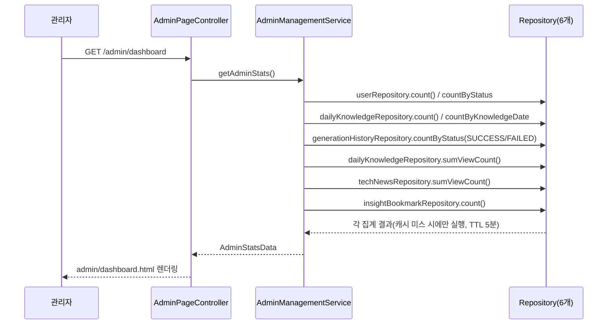

# Unit 11: 관리자 대시보드 — Compact Card

> **Project**: dailyDevInsight | **Date**: 2026-08-05 | **문서 유형**: 1차 Compact Card
> Phase 3

## ① 목적

관리자 진입 시 첫 화면. 회원/게시물/생성/조회수/북마크 요약 통계를 한눈에 보여줌.

## ② 관련 파일

- `AdminPageController.adminRoot()`(`/admin` → 대시보드 리다이렉트), `dashboardPage()`
- `AdminManagementService.getAdminStats()`
- `AdminStatsData` DTO
- `templates/admin/dashboard.html`, `fragments/adminNav.html`

## ③ 진입 엔드포인트

| Method | Path | 용도 |
|---|---|---|
| GET | `/admin` | `/admin/dashboard`로 리다이렉트 |
| GET | `/admin/dashboard` | 대시보드 렌더링 |

## ④ 핵심 호출 흐름

`getAdminStats()`가 6개 Repository에서 단순 집계 쿼리(count/sum)를 각각 실행해 하나의 `AdminStatsData`로 조합. **[2026-08-06 갱신] `@Cacheable(cacheNames = "adminStats")`로 캐시 적용됨(TTL 5분)** — 매 요청 재집계가 아니라 캐시 미스 시에만 재집계.

### 처리 흐름도

## ⑤ 데이터/외부 연동

| 지표 | 소스 |
|---|---|
| 전체/활성 회원 수 | `UserRepository.count()` / `countByStatusIgnoreCase("ACTIVE")` |
| 전체/오늘 게시물 수 | `DailyKnowledgeRepository.count()` / `countByKnowledgeDate(today)` — **지식 콘텐츠만 집계, 뉴스는 "게시물" 통계에 포함 안 됨** |
| 생성 성공/실패 건수 | `GenerationHistoryRepository.countByStatus()` |
| 총 조회수 | `dailyKnowledgeRepository.sumViewCount() + techNewsRepository.sumViewCount()` (지식+뉴스 합산) |
| 총 북마크 수 | `InsightBookmarkRepository.count()` |

## ⑥ 인증·트랜잭션·캐시

- 인증: `/admin/**`이므로 관리자 권한 필요 (Unit 8 참조)
- 트랜잭션: `@Transactional(readOnly = true)`
- **[2026-08-06 갱신] 캐시: `adminStats`(Redis, TTL 5분) 적용.** 게시물/회원 관련 admin 쓰기 작업(`AdminManagementService`의 게시물 수정/삭제/`updateUser`, 지식 생성/뉴스 크롤링 실행)에서 `@CacheEvict(allEntries=true)`로 함께 무효화되어 관리자가 직접 콘텐츠를 변경한 직후에는 최신값이 반영됨. 조회수 증가(공개 페이지 뷰) 등 매우 잦은 이벤트는 evict 대상에서 제외 — TTL(5분) 내 최신성 지연은 허용

## ⑦ 화면 요약

- 통계 카드 그리드(회원/게시물/생성 성공·실패/조회수/북마크)
- 좌측 관리자 네비게이션 공통 fragment

## ⑧ 패턴 특이사항

- **"게시물 수" 지표가 지식(`DailyKnowledge`)만 집계하고 뉴스(`TechNews`)는 제외** — 반면 "조회수"는 지식+뉴스 합산. 같은 대시보드 안에서 지표별로 집계 대상 콘텐츠 타입이 다름 (의도적 정의인지 누락인지는 화면 라벨 확인 필요)

## ⑨ 알아둘 점 / 리스크

- **[2026-08-06 해결, F-12 반영]** 통계가 매 요청마다 6개 쿼리를 실시간 집계하던 문제를 `adminStats` 캐시(TTL 5분) 적용으로 완화. Phase 1(P1-1) 작업 결과

---

## Version History

| Version | Date | Changes |
|---|---|---|
| 0.1 | 2026-08-05 | 최초 작성 (1차 사이클 compact card) |
| 0.2 | 2026-08-06 | 처리 흐름도(Mermaid) 추가 |
| 0.3 | 2026-08-06 | Phase 1(P1-1) 반영 — `getAdminStats()`에 `adminStats` 캐시(TTL 5분) 적용, 관련 admin 쓰기 작업에 evict 연결 |
