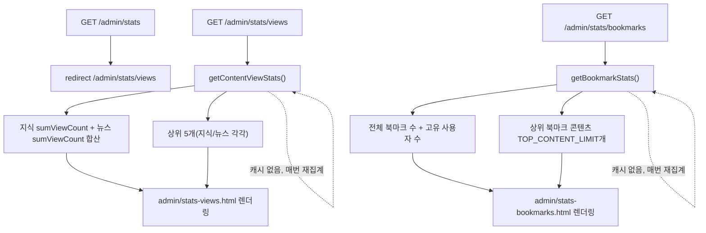

# Unit 16: 통계 (조회수/북마크) — Compact Card

> **Project**: dailyDevInsight | **Date**: 2026-08-05 | **문서 유형**: 1차 Compact Card
> Phase 3

## ① 목적

관리자가 콘텐츠 조회수·북마크 현황을 상세 통계로 확인 (Unit 11 대시보드의 요약 수치를 더 깊게 본 화면).

## ② 관련 파일

- `AdminPageController.statsRootPage()` / `statsViewsPage()` / `statsBookmarksPage()`
- `AdminManagementService.getContentViewStats()` / `getBookmarkStats()`
- `templates/admin/stats-views.html`, `admin/stats-bookmarks.html`

## ③ 진입 엔드포인트

| Method | Path | 용도 |
|---|---|---|
| GET | `/admin/stats` | `/admin/stats/views`로 redirect |
| GET | `/admin/stats/views` | 조회수 통계 화면 |
| GET | `/admin/stats/bookmarks` | 북마크 통계 화면 |

## ④ 핵심 호출 흐름

- 조회수: 지식/뉴스 각각 `sumViewCount()` 합산 + 콘텐츠 타입별 상위 5개(`mapTopKnowledgeByViewCount`/`mapTopNewsByViewCount`) 조회
- 북마크: 전체 북마크 수(`count()`) + 북마크를 남긴 고유 사용자 수(`countDistinctUserId()`) + 상위 북마크 콘텐츠(`findTopBookmarkedContents`, `TOP_CONTENT_LIMIT`개)

### 처리 흐름도

## ⑤ 데이터/외부 연동

Unit 1(조회수 필드), Unit 3(북마크 엔티티) 데이터를 그대로 재사용 — 별도 통계 전용 테이블/집계 배치 없이 **매 요청 실시간 집계**.

## ⑥ 인증·트랜잭션·캐시

- 인증: 관리자 권한 필요
- 캐시 없음 — Unit 11(대시보드)과 마찬가지로 실시간 집계, 데이터 많아지면 성능 이슈 후보

## ⑦ 화면 요약

- 조회수: 총계 + 지식/뉴스 분리 + 상위 5개 리스트
- 북마크: 총계 + 참여 사용자 수 + 상위 콘텐츠 리스트

## ⑧ 패턴 특이사항

- Unit 11(대시보드)의 요약 수치와 이 unit의 상세 수치가 **부분적으로 같은 소스**(`sumViewCount`, `insightBookmarkRepository.count()`)를 각각 별도로 재조회 — 대시보드 진입 후 상세 통계로 이동하면 사실상 같은 쿼리가 한 번 더 실행됨(공유 캐시나 단일 조회 재사용 없음)

## ⑨ 알아둘 점 / 리스크

- Unit 11과 동일하게 실시간 전체 집계라 데이터 규모 증가 시 캐시 적용 후보 1순위(대시보드+통계 두 곳 모두)

---

## Version History

| Version | Date | Changes |
|---|---|---|
| 0.1 | 2026-08-05 | 최초 작성 (1차 사이클 compact card) |
| 0.2 | 2026-08-06 | 처리 흐름도(Mermaid) 추가 |
