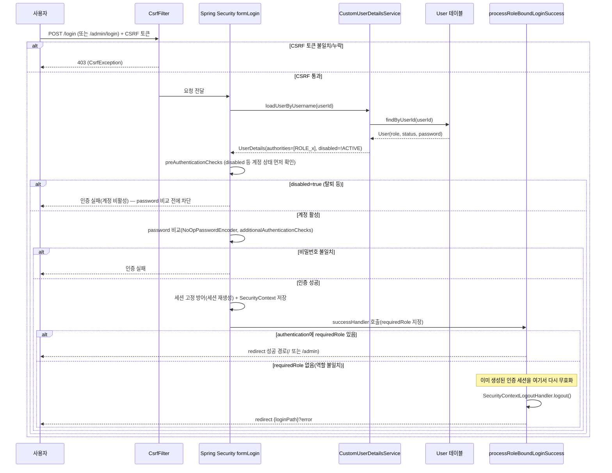

# 인증/보안 체계 Design Document

> **Summary**: 사용자/관리자 인증·인가 필터 체인, 사용자 조회·비밀번호 검증, 역할(Role) 기반 접근 제어를 담당하는 횡단 관심사
>
> **Project**: dailyDevInsight
> **Date**: 2026-08-06
> **Status**: **Implemented (사후 문서화, 2차 사이클 정밀화)** — SoR: 코드 우선

---

## Context Anchor

| Key | Value |
|-----|-------|
| **WHY** | 사용자/관리자 경로를 분리 보호하고 계정 권한에 맞는 접근만 허용 |
| **WHO** | 전체 인증 사용자, Unit 5·6·17이 이 체계에 의존 |
| **RISK** | `NoOpPasswordEncoder`(평문 비교), 로그아웃 로직 중복 |
| **SUCCESS** | 역할 불일치 로그인 자동 차단, 탈퇴 계정 즉시 로그인 불가 |
| **SCOPE** | 필터체인, 사용자 조회, 비밀번호 검증, 로그아웃 |

---

## 1. Overview

### 1.1 목적

`SecurityConfig`의 2개 필터체인이 `/admin/**`과 나머지 경로를 완전히 분리 보호하고, 로그인 성공 후에도 계정 role이 그 경로에 맞는지 재검증한다.

### 1.2 관련 파일

| 레이어 | 파일 |
|--------|------|
| Config | `SecurityConfig` |
| Service | `CustomUserDetailsService`, `UserService`, `AuthService` |
| Controller | `LoginController`, `AuthController` |
| Entity | `User` (`role`, `status`, `password`) |
| Test | `SecurityConfigLoginFlowTest`(4건), `AuthControllerTest`(2건) |

---

## 2. Data Model

`User` 엔티티 중 이 unit이 사용하는 필드:

| 필드 | 용도 |
|---|---|
| `userId` | 로그인 아이디(username) |
| `password` | 비밀번호(현재 `NoOpPasswordEncoder`이므로 사실상 평문 저장/비교) |
| `role` | `"USER"`/`"ADMIN"` 등 문자열 — `CustomUserDetailsService`가 `"ROLE_" + role`로 변환. **[Codex 검증 발견] `role`이 null이면 기본값 `"USER"`로 처리되고, 임의 문자열도 검증 없이 그대로 `"ROLE_" + 값`으로 변환됨** — enum 검증 없음(findings F-08 회원관리 이슈와 연관) |
| `status` | `"ACTIVE"`/`"WITHDRAWN"` — `ACTIVE`가 아니면 `UserDetails.disabled=true` |

별도 세션/토큰 테이블 없음 — Spring Security 기본 세션 기반 인증.

---

## 3. 동작 명세

### 3.1 필터체인 구성

| 체인 | Order | 매칭 경로 | 요구 권한 | loginPage |
|---|---|---|---|---|
| `adminSecurityFilterChain` | 1 | `/admin/**` | `ROLE_ADMIN` (로그인/정적리소스 제외) | `/admin/login` |
| `userSecurityFilterChain` | 2 | 나머지 전체 | **`ROLE_USER`** (`/auth/logout`만 `authenticated()` 예외) | `/login` |

두 체인은 `securityMatcher`로 요청 경로 매칭은 상호 배타적이다(`/admin/**`은 반드시 admin 체인만 적용). 인증 세션(SecurityContext) 자체는 두 체인이 공유하지만, **[2026-08-06 수정 완료]** `userSecurityFilterChain`에 `hasRole("USER")`를 적용해 `ROLE_ADMIN`으로 로그인한 세션이 `/mypage/**` 등 일반 사용자 경로에 접근하지 못하도록 차단했다. 단 `/auth/logout`은 관리자/사용자 공용 엔드포인트(`fragments/header.html`이 양쪽 레이아웃에서 공유)라 역할 제한 없이 `authenticated()`만 요구하도록 예외 처리했다 — 그렇지 않으면 관리자가 로그아웃을 못 하게 되는 회귀가 발생함.

### 3.2 처리 흐름도 — 역할 재검증 로그인

> **[Codex 검증 정정]** 최초 버전은 "비밀번호 비교 → disabled 분기" 순서로 그렸으나, Spring Security 기본 동작은 **계정 상태(`disabled` 등) 확인이 비밀번호 비교보다 먼저** 수행된다(`preAuthenticationChecks` → `additionalAuthenticationChecks`). CSRF 검증 단계와 세션 고정 방어(로그인 성공 시 세션 재생성) 단계도 최초 버전에서 누락되어 있었음.

### 3.3 핵심 로직 상세

1. **인증**: `CustomUserDetailsService.loadUserByUsername()` → DB 조회 → `role`을 `"ROLE_" + role`로, `status`를 `disabled` 플래그로 변환
2. **역할 재검증**: 로그인 자체는 두 체인 모두 `authenticated()`/`hasRole("ADMIN")` 기준만 통과하면 성공하지만, `successHandler`(`processRoleBoundLoginSuccess`)가 **해당 로그인 경로가 요구하는 role을 계정이 실제로 가지고 있는지 다시 확인** — 없으면 그 자리에서 로그아웃 처리 후 에러 리다이렉트
3. **로그아웃**: **[Codex 검증 정정] 로그아웃이 실행되는 지점은 최소 3곳**: ① `POST /auth/logout` → `AuthController` → `AuthService.logout()`(공용 `SecurityContextLogoutHandler` 인스턴스), ② `MyPageController.processWithdraw()`가 별도로 `new SecurityContextLogoutHandler()`를 직접 생성, ③ `SecurityConfig`의 역할 불일치 처리(`processRoleBoundLoginSuccess`)도 그 자리에서 `new SecurityContextLogoutHandler().logout()` 호출. **게다가 `SecurityConfig`가 `.logout(...)`을 별도로 커스터마이징하지 않아 Spring Security 기본 `/logout` 엔드포인트도 여전히 살아있음** — 이 프로젝트가 실제로 쓰지 않는 경로지만 비활성화되어 있지 않음
4. **비밀번호 검증/변경**: `UserService`가 `PasswordEncoder.matches()`로 확인 — 인코더가 `NoOpPasswordEncoder`이므로 사실상 문자열 동일성 비교. **[Codex 검증 발견] `NoOpPasswordEncoder.encode()`는 입력값을 그대로 반환** — 즉 로그인 시 "비교"만 평문인 게 아니라, **비밀번호 변경 시 저장(`changePassword`)도 원문 그대로 DB에 기록됨**(암호화가 아예 발생하지 않음)
5. **관리자 CSRF/권한부족 구분**: `processAdminAccessDenied()`가 `CsrfException`이면 CSRF 에러로, 아니면 일반 권한부족으로 분기. **CSRF 실패 시 Referer가 `/admin/posts/`를 포함하면 그 경로로 되돌아가고, 그 외에는 `/admin/login?csrfError=true`로 이동** — `/admin/posts/`만 특별 취급하는 이유는 코드에 근거 없음

---

## 4. UI/UX

이 unit 자체는 화면이 없다(Unit 5·17이 로그인 화면 소유). 로그아웃은 리다이렉트만 발생시키고 별도 화면 없음.

---

## 5. Error Handling

| 상황 | 처리 |
|------|------|
| 아이디/비밀번호 불일치 | Spring Security 기본 인증 실패 → `{loginPath}?error` |
| `status != ACTIVE` 계정 로그인 시도 | `UserDetails.disabled=true`로 Spring Security가 자동 거부(위와 동일 에러 경로로 합류, 원인 구분 없음) |
| 역할 불일치(다른 role로 로그인 성공) | `processRoleBoundLoginSuccess`가 강제 로그아웃 후 `{loginPath}?error` — **비밀번호 불일치와 동일한 `error` 파라미터를 써서, 사용자 입장에서 "비밀번호 틀림"과 "권한 없음"을 구분할 수 없음** |
| 관리자 CSRF 실패 | `?csrfError=true` (일반 권한부족과 다른 파라미터로 구분됨 — 사용자 로그인 쪽엔 이런 세분화 없음) |
| 사용자 영역(`/mypage/**` 등) CSRF 실패 | 관리자와 달리 별도 핸들러 없음 — Spring Security 기본 403 흐름(Codex 검증 발견, 문서에 없던 사실) |
| 비밀번호 변경 시 현재 비밀번호 불일치 | `IllegalArgumentException` → `MyPageController`가 catch해 `errorMessage` flash |

---

## 6. Security Considerations

- **`NoOpPasswordEncoder` 사용 중** — 로그인 비교뿐 아니라 **비밀번호 변경 시 저장도 암호화 없이 원문 그대로 기록됨**(`encode()`가 입력을 그대로 반환). 프로덕션 배포 전 최우선 해결 필요
- ~~**[Codex 검증 발견 — High] 관리자로 로그인한 세션이 일반 사용자 경로(`/mypage/**` 등)에도 그대로 접근 가능**~~ **✅ 수정 완료 (2026-08-06)**: 사용자 결정에 따라 `userSecurityFilterChain`의 `anyRequest()`에 `hasRole("USER")`를 적용해 차단. `/auth/logout`은 관리자/사용자 공용 엔드포인트라 `authenticated()`로 별도 예외 처리(그렇지 않으면 관리자 로그아웃이 깨짐 — `fragments/header.html`이 `/auth/logout`을 공유 사용하는 것을 확인 후 반영). 전체 테스트(14개 클래스, 64건) 통과 확인
- **[Codex 검증 발견 — Medium, 잠재적 오픈 리다이렉트] `processAdminAccessDenied()`가 CSRF 실패 시 `Referer` 헤더를 신뢰하고, 그 안에 `/admin/posts/` 문자열이 포함되면 검증 없이 그대로 리다이렉트함.** `Referer`는 클라이언트가 임의로 설정 가능한 헤더이므로, 이 문자열만 포함하면 외부 도메인으로도 리다이렉트될 이론적 가능성이 있음(예: `https://evil.example/admin/posts/`)
- **[Codex 검증 발견] `role` 필드에 대한 서버 측 검증 부재** — null이면 `"USER"` 기본 처리, 임의 문자열도 그대로 `"ROLE_" + 값`으로 변환되어 존재하지 않는 권한 문자열이 생성될 수 있음(Unit 14 회원관리 findings F-08과 연결되는 문제)
- 로그인 성공 후 역할 재검증이 있어, "회원가입 시 role 조작" 같은 공격이 있어도 최소한 로그인 경로 오남용은 방어됨
- 세션 기반 인증 — 별도 JWT/토큰 발급 없음. **동시 세션 제한/세션 레지스트리가 없어, 비밀번호 변경이나 탈퇴가 발생해도 다른 브라우저의 기존 로그인 세션은 즉시 무효화되지 않고 계속 유지될 수 있음**(Codex 검증 발견)

---

## 7. 테스트 현황

`SecurityConfigLoginFlowTest` 4건: 사용자 로그인(정상/역할불일치), 관리자 로그인(정상/역할불일치) — **FR-01~FR-03이 테스트로 커버됨**.
`AuthControllerTest` 2건: 일반 로그아웃, 관리자 로그아웃 리다이렉트 확인 — **단, `AuthService`를 mock 처리하므로 실제 세션 무효화 자체는 검증하지 않음(리다이렉트 경로만 검증)**.
`LoginControllerTest`: `/admin/login`의 error/adminDenied/csrfError 쿼리 파라미터별 flash 메시지 분기를 검증하는 테스트 존재.
**[Codex 검증 정정] `AdminPageControllerTest`에 CSRF 토큰 누락 시 `csrfError=true`로 리다이렉트되는 것을 검증하는 테스트가 존재** — 최초 버전에서 "FR-06 테스트 없음"으로 잘못 기재했던 것을 정정.

**커버 안 된 케이스**: `status=WITHDRAWN` 계정의 로그인 거부(FR-04), 비밀번호 변경/탈퇴 시 현재 비밀번호 검증(FR-05, `UserService` 유닛 테스트 없음), 로그아웃의 실제 세션 무효화 여부(현재는 mock이라 리다이렉트만 검증), 관리자 세션의 사용자 경로 접근 가능 여부.

---

## 8. Known Gaps / 후속 작업 후보

- **`NoOpPasswordEncoder` 사용 — 최우선 보안 이슈**(findings F-01). 로그인 비교뿐 아니라 비밀번호 변경 저장 시에도 암호화가 발생하지 않음. 실제 인코더 교체 시 기존 평문 비밀번호 마이그레이션 전략 필요
- **[Codex 검증 발견, High] 관리자 세션으로 일반 사용자 경로 접근이 가능함** — `userSecurityFilterChain`이 role을 구분하지 않기 때문. 의도된 것인지(관리자도 일반 사용자 기능을 쓸 수 있어야 하는지) 정책 확인 필요, 의도가 아니라면 `hasRole("USER")`로 강화 검토
- **[Codex 검증 발견, Medium] CSRF 실패 리다이렉트가 `Referer` 헤더의 부분 문자열만 검사해 잠재적 오픈 리다이렉트 가능성 있음** — 화이트리스트 방식(정확한 경로 매칭)으로 개선 검토
- **로그아웃 로직이 최소 3곳에 중복 구현**(findings F-02, Codex 검증으로 SecurityConfig의 역할불일치 처리도 별도 지점임을 확인) — `AuthService` 단일화 검토. Spring Security 기본 `/logout` 엔드포인트도 비활성화되지 않은 채 남아있음
- `role` 필드에 서버 측 enum 검증이 없음(null→USER 기본값, 임의 문자열 허용) — Unit 14 회원관리와 함께 검토 필요
- 역할 불일치와 비밀번호 불일치가 동일한 `error` 파라미터로 뭉뚱그려져 사용자가 원인을 구분할 수 없음
- 관리자 CSRF 실패 처리가 `/admin/posts/` 경로만 특별 취급 — 근거 불명, 다른 관리자 경로로 일반화할지 검토
- 동시 세션 제한 없음 — 비밀번호 변경/탈퇴 후에도 다른 브라우저의 기존 세션이 유지될 수 있음
- `status=WITHDRAWN`의 로그인 거부, 비밀번호 검증 로직에 대한 유닛 테스트 부재, 로그아웃의 실제 세션 무효화 검증 부재(현재 mock 처리)

---

## Version History

| Version | Date | Changes | Author |
|---------|------|---------|--------|
| 0.1 | 2026-08-05 | 1차 사이클 compact card 작성 | Claude (대화 기반) |
| 0.2 | 2026-08-06 | 2차 사이클 정밀화 — Data Model/필터체인 구성/Mermaid 흐름도/Error Handling/Security/테스트 현황/Known Gaps 추가 | Claude (대화 기반) |
| 0.3 | 2026-08-06 | Codex 검증 반영 — **관리자 세션의 사용자 경로 접근 가능(High) 신규 발견**, CSRF Referer 오픈 리다이렉트 가능성 발견, Mermaid 순서 정정(계정상태 확인이 비밀번호 비교보다 먼저 + CSRF·세션고정방어 단계 추가), 로그아웃 지점 2→3곳 정정, `NoOpPasswordEncoder.encode()`가 저장 시에도 평문임을 명확화, FR-06 테스트 존재 사실로 정정, role 필드 검증 부재 추가 | Claude (Codex `codex exec -s read-only` 검증 결과 반영) |
| 0.4 | 2026-08-06 | **사용자 결정에 따라 관리자 세션의 사용자 경로 접근 차단을 실제 코드로 수정** — `SecurityConfig.userSecurityFilterChain()`에 `hasRole("USER")` 적용, `/auth/logout`은 공용 엔드포인트라 예외 처리. 전체 테스트 14클래스 64건 통과 확인(JDK 21) | Claude (사용자 승인 후 코드 수정) |
