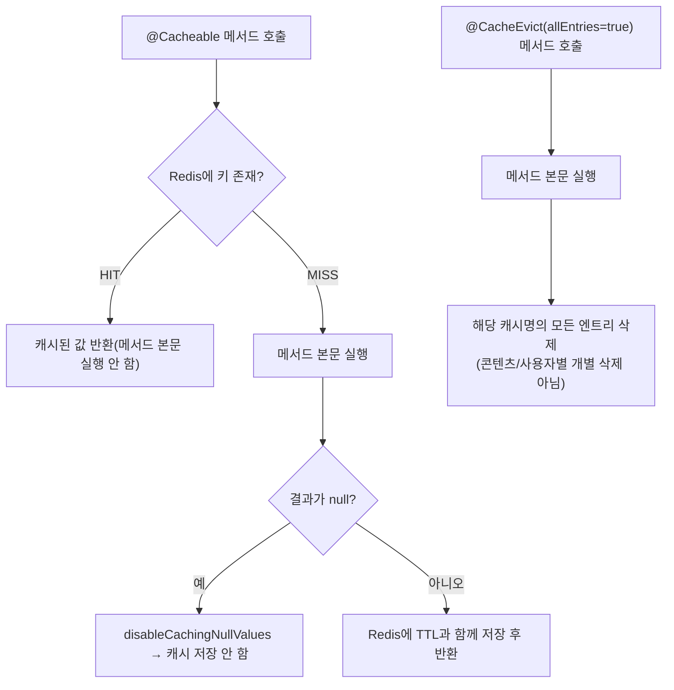

# Unit 9: 캐시 정책 — Compact Card

> **Project**: dailyDevInsight | **Date**: 2026-08-05 | **문서 유형**: 1차 Compact Card
> Phase 2 (화면 없음)

## ① 목적

Redis 기반 캐시 매니저와 캐시별 TTL 정책을 정의하는 횡단 관심사. Unit 1(홈), Unit 2(상세)가 실사용.

## ② 관련 파일

- `RedisCacheConfig` — `CacheManager` Bean, 캐시명 상수 **[2026-08-06 갱신] 8개**, TTL 정책
- 실사용처: `DailyInsightService`(Unit 1), `DailyKnowledgeService`(주간 TOP), `InsightDetailService`(Unit 2), **[2026-08-06 추가] `AdminManagementService`(Unit 11/16 대시보드·통계)**

## ③ 진입 엔드포인트

없음 (설정 클래스)

## ④ 핵심 호출 흐름

`@Cacheable`/`@CacheEvict` 어노테이션이 붙은 서비스 메서드가 Spring AOP를 통해 자동으로 이 `CacheManager`를 거침. 직접 호출 흐름은 없고 선언적으로 동작.

### 처리 흐름도

## ⑤ 데이터/외부 연동

- Redis 서버 연동 (`RedisConnectionFactory` 필요, `docker-compose.yml`에 Redis 컨테이너 정의 여부는 별도 확인 필요)
- 값 직렬화: `GenericJackson2JsonRedisSerializer` + `JavaTimeModule`(LocalDate 등 처리) + `activateDefaultTyping`(다형성 타입 정보 포함 직렬화)

## ⑥ 캐시별 정책 (실측)

| 캐시명 | 상수 | TTL | 사용처 |
|---|---|---|---|
| `weeklyHotTop10` | `CACHE_WEEKLY_TOP10` | 20분 | `DailyKnowledgeService.findWeeklyHotKnowledgeTop10` (Unit 1) |
| `weeklyHotTop5` | `CACHE_WEEKLY_TOP5` | 20분 | `DailyKnowledgeService.findWeeklyHotKnowledgeTop5` (Unit 1) |
| `insightsByDate` | `CACHE_INSIGHTS_BY_DATE` | 10분 | `DailyInsightService.getInsightsByDate` (Unit 1, `/api/insights`) |
| `insightsByRange` | `CACHE_INSIGHTS_BY_RANGE` | 5분 | `DailyInsightService.getInsightsByRange` (Unit 1, 홈 화면) |
| `insightEngagement` | `CACHE_INSIGHT_ENGAGEMENT` | 90초 | `InsightDetailService.getEngagementOnly` (Unit 2) |
| `adminStats` | `CACHE_ADMIN_STATS` | 5분 | `AdminManagementService.getAdminStats` (Unit 11, **2026-08-06 신규**) |
| `adminContentViewStats` | `CACHE_ADMIN_CONTENT_VIEW_STATS` | 5분 | `AdminManagementService.getContentViewStats` (Unit 16, **2026-08-06 신규**) |
| `adminBookmarkStats` | `CACHE_ADMIN_BOOKMARK_STATS` | 5분 | `AdminManagementService.getBookmarkStats` (Unit 16, **2026-08-06 신규**) |
| (미지정 나머지) | — | 기본 10분 | — |

- `disableCachingNullValues()` 전역 적용 — null 반환값은 캐시 안 함
- 캐시 무효화는 각 서비스가 `@CacheEvict`로 개별 관리 (이 설정 파일 자체에는 무효화 트리거 없음)

## ⑦ 화면 요약

없음

## ⑧ 패턴 특이사항

- **[Unit 1 조사 정정 반영]** 최초 Unit 1 compact card 작성 시 "Top10은 캐시 안 됨"으로 잘못 기록했으나, 실제로는 Top10/Top5 둘 다 20분 TTL로 캐시됨 — grep 기반 조사의 컨텍스트 누락으로 인한 오류였고 이 unit 작성 중 발견해 정정함(§Version History 참고, `home-insight-list.md`도 함께 수정됨)
- `insightEngagement`(90초)만 다른 캐시 대비 TTL이 극단적으로 짧음 — 좋아요/북마크/댓글처럼 실시간성이 중요한 데이터라서로 추정되나 명시적 근거 주석은 없음
- `@CacheEvict(allEntries = true)` 패턴이 여러 서비스(Unit 2, 12, 13, **2026-08-06 추가: Unit 11/15 admin 통계·게시물 관리**)에서 공통적으로 쓰임 — 특정 키만 evict하는 세밀한 무효화는 이 프로젝트에 없음 (일괄 무효화만 존재)

### [2026-08-06] P1-3 캐시 무효화 전략 점검 결과 (F-04 관련)

Phase 1(P1-3) 작업으로 프로젝트 전체의 `@CacheEvict`/`@Cacheable` 사용처(`AdminManagementService`, `DailyKnowledgeGenerationService`, `TechNewsCrawlingService`, `InsightDetailService`, `DailyKnowledgeService`, `DailyInsightService`)를 전수 점검함. 결론: **현재의 `allEntries=true` 일괄 무효화 전략을 유지하는 것이 타당하다고 판단**하고 코드는 변경하지 않음. 근거:

1. **캐시 키 공간이 작음** — `insightsByDate`/`insightsByRange`/`weeklyHotTop10`/`weeklyHotTop5`는 날짜·기간 문자열 키이고, `adminStats` 등 신규 3종은 무인자 단일 엔트리다. 전체 캐시를 비워도 다음 요청에서 다시 채워지는 비용이 작다.
2. **쓰기 빈도가 낮음** — 무효화를 트리거하는 지점은 관리자의 게시물 수정/삭제, 콘텐츠 생성/크롤링 실행처럼 사람이 직접 유발하는 저빈도 이벤트다. 조회수 증가처럼 매우 잦은 이벤트는 의도적으로 evict 대상에서 제외했다(TTL 만료로만 갱신).
3. **정밀 무효화의 비용 대비 효과가 낮음** — 예를 들어 `insightsByRange`는 어떤 날짜 범위가 새 게시물의 영향을 받는지 알아내려면 별도 로직이 필요한데, 이 프로젝트 규모(개인/소규모 블로그형 서비스)에서는 이득이 크지 않다.
4. `insightEngagement`(좋아요/북마크/댓글) 캐시는 TTL이 90초로 이미 매우 짧고, 캐시 키에 `loginUserId`가 포함돼 있어 "특정 콘텐츠에 대한 모든 사용자의 캐시"만 골라 지우는 정밀 무효화가 사실상 불가능하다(사전에 캐시된 모든 사용자 조합을 알 수 없음) — 90초 TTL이 이미 이 문제를 실질적으로 상쇄하므로 재설계하지 않음.

**향후 재검토 조건**: 트래픽/데이터 규모가 커져 캐시 재채움 비용이나 evict 빈도가 실제로 문제가 되면(예: 관리자 쓰기 작업이 초 단위로 빈번해지는 등) 그때 정밀 무효화 도입을 재검토한다.

**[2026-08-06] Codex 교차검증 반영 — admin 통계 캐시 evict 커버리지 보강**: 최초 구현에서는 `adminStats`/`adminContentViewStats`/`adminBookmarkStats`를 admin 쓰기 작업(게시물 수정/삭제, 회원 role/status 변경)에서만 evict했으나, 다음 두 지점이 빠져 있어 Codex 리뷰로 보강함 — (1) 회원 탈퇴(`MyPageService.withdraw()`)는 `status`를 `WITHDRAWN`으로 바꿔 `activeUsers` 지표에 영향을 주므로 `adminStats` evict 추가, (2) 지식 생성(`DailyKnowledgeGenerationService`)·뉴스 크롤링(`TechNewsCrawlingService`) 실행은 콘텐츠가 0회 조회로 신규 등록되며 상위 5개 목록(`topKnowledgeList`/`topNewsList`)이 5개 미만인 초기 상태에서는 즉시 반영돼야 하므로 `adminContentViewStats` evict 추가. **의도적으로 evict하지 않은 지점**: 조회수 증가(콘텐츠 상세 조회), 좋아요/북마크 토글은 매 요청 수준으로 빈번해 evict 시 캐시 효과가 사실상 사라지므로 위 근거 2/4에 따라 TTL(5분) 기반 지연만 허용한다 — 다음 리뷰에서 "누락"으로 재지적되지 않도록 명시.

## ⑨ 알아둘 점 / 리스크

- `activateDefaultTyping(NON_FINAL)`은 역직렬화 시 클래스 타입 정보를 신뢰한다는 뜻 — Redis 자체가 내부 인프라라 외부 입력이 직접 캐시에 주입될 경로는 없어 보이나, 일반적으로 이 설정은 역직렬화 보안 이슈(gadget chain 등)의 알려진 주의 대상이라는 점은 기록해둘 가치 있음(이 프로젝트에서 실제 악용 경로가 있는지는 확인 못함)
- Redis 장애 시 캐시 미스가 아니라 애플리케이션 전체 오류로 이어지는지(fail-open/fail-closed) 여부는 이번 조사 범위 밖 — 정밀화 시 확인 필요

---

## Version History

| Version | Date | Changes |
|---|---|---|
| 0.1 | 2026-08-05 | 최초 작성 (1차 사이클 compact card) — Unit 1의 "Top10 캐시 미적용" 오류를 발견해 정정 |
| 0.2 | 2026-08-06 | 처리 흐름도(Mermaid) 추가 |
| 0.3 | 2026-08-06 | Phase 1(P1-1, P1-3) 반영 — `adminStats`/`adminContentViewStats`/`adminBookmarkStats` 3개 캐시(TTL 5분) 추가, `allEntries=true` 일괄 무효화 전략 전수 점검 결과(유지 결정, 근거) 기록 |
| 0.4 | 2026-08-06 | Codex 교차검증 반영 — admin 통계 캐시의 evict 커버리지 보강(회원 탈퇴, 지식 생성/뉴스 크롤링), 조회수/좋아요/북마크는 의도적으로 evict 제외임을 명시 |
