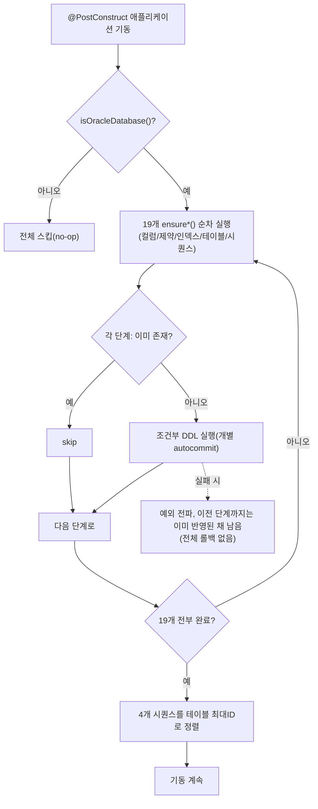

# Unit 10: DB 스키마 전체 (마이그레이션) — Compact Card

> **Project**: dailyDevInsight | **Date**: 2026-08-05 | **문서 유형**: 1차 Compact Card
> Phase 2 (화면 없음)

## ① 목적

Oracle 스키마에 필요한 컬럼/제약조건/인덱스/시퀀스를 애플리케이션 기동 시 자동으로 보정(idempotent migration). 별도 마이그레이션 툴(Flyway/Liquibase) 없이 자체 구현.

## ② 관련 파일

- `OracleSchemaMigrationRunner` (528줄, `@PostConstruct`로 기동 시 1회 실행)
- `docs/sql/*_oracle.sql` — 일부 변경 이력의 대응 문서 (10개 파일, 날짜순)

## ③ 진입 엔드포인트

없음. `@PostConstruct` 기동 훅으로만 실행, HTTP 경로 없음.

## ④ 핵심 호출 흐름

1. `isOracleDatabase()`로 활성 프로파일이 Oracle인지 먼저 확인 — **아니면 전체 스킵** (테스트 환경 등 다른 DB 프로파일에서는 이 클래스가 사실상 no-op)
2. `ensureOracleSchemaMigrations()`가 **19개 개별 `ensure*()` 메서드를 고정 순서로 순차 실행** — 각 메서드는 "이미 있으면 skip, 없으면 생성/추가"하는 idempotent 패턴 (`existsTable`/`existsColumn`/`existsConstraint` 체크 후 조건부 DDL)
3. 다루는 대상: `insight_comment`(대댓글 컬럼/FK/인덱스), `daily_knowledge`/`tech_news`(첨부이미지 컬럼), `generation_schedule`/`generation_history`, `crawl_schedule`/`crawl_history`/`crawl_condition_preset`(테이블+컬럼+시퀀스 전체 신규), `weekly_ai_insight`(테이블+시퀀스 전체 신규)
4. 마지막에 4개 시퀀스를 테이블의 현재 최대 ID와 정렬(`ensureSequenceAlignedWithTableMaxId`) — 시퀀스가 테이블 데이터보다 뒤처지는 상황 보정용으로 추정

### 처리 흐름도

## ⑤ 데이터/외부 연동

- `JdbcTemplate`으로 직접 DDL 실행 (JPA/Hibernate 자동 스키마 생성 아님)
- `docs/sql/`의 10개 SQL 파일과 부분적으로 대응하지만 **1:1 매핑 문서는 없음** — 이 클래스가 최신 스키마 변경의 사실상 유일한 기준(SoR)

## ⑥ 인증·트랜잭션·캐시

- 인증 없음(기동 훅)
- 트랜잭션 어노테이션 없음 — 각 DDL이 개별 autocommit으로 실행되는 것으로 추정(Oracle DDL은 일반적으로 암묵적 커밋), 즉 **19개 중 중간에 실패하면 그 이전 단계까지는 이미 반영된 상태로 남음** (전체 롤백 불가)
- 캐시 없음

## ⑦ 화면 요약

없음

## ⑧ 패턴 특이사항

- **Flyway/Liquibase 같은 버전 관리형 마이그레이션 도구를 쓰지 않고, 자체 idempotent 체크 코드로 구현** — 이 프로젝트에서 유일하게 "DDL을 코드로 관리"하는 영역이며, `docs/sql/*.sql`은 참고용 기록이지 실행되는 마이그레이션이 아님
- 유니크 인덱스/제약조건이 **테이블을 새로 생성할 때만 함께 생성**되는 패턴(`ensureWeeklyAiInsightTable` 등) — 이미 테이블이 있는 환경에서 인덱스만 빠진 경우는 별도로 보정하는 메서드가 없어 자동 복구 안 됨 (weekly-ai-insight Design 문서에서 이미 지적된 사항과 동일한 구조가 다른 테이블에도 반복될 수 있음)

## ⑨ 알아둘 점 / 리스크

- **`docs/sql/`에 대응 파일이 없는 변경**: `weekly_ai_insight` 테이블/시퀀스 전체가 코드에만 존재 (기존 weekly-ai-insight 문서화에서 이미 확인된 사항, 여기서 전체 스키마 관점으로 재확인)
- 19개 메서드가 고정 순서로 실행되는데 순서 자체에 대한 의존성 설명(왜 이 순서여야 하는지)이 주석에 없음 — 순서를 바꾸면 위험할 수 있는지 불명
- DDL 실행 실패 시 부분 반영 상태로 남을 수 있어, 배포 후 기동 로그를 반드시 확인해야 하는 구조(자동 알림/헬스체크 연동 여부는 확인 못함)

---

## Version History

| Version | Date | Changes |
|---|---|---|
| 0.1 | 2026-08-05 | 최초 작성 (1차 사이클 compact card) |
| 0.2 | 2026-08-06 | 처리 흐름도(Mermaid) 추가 |
