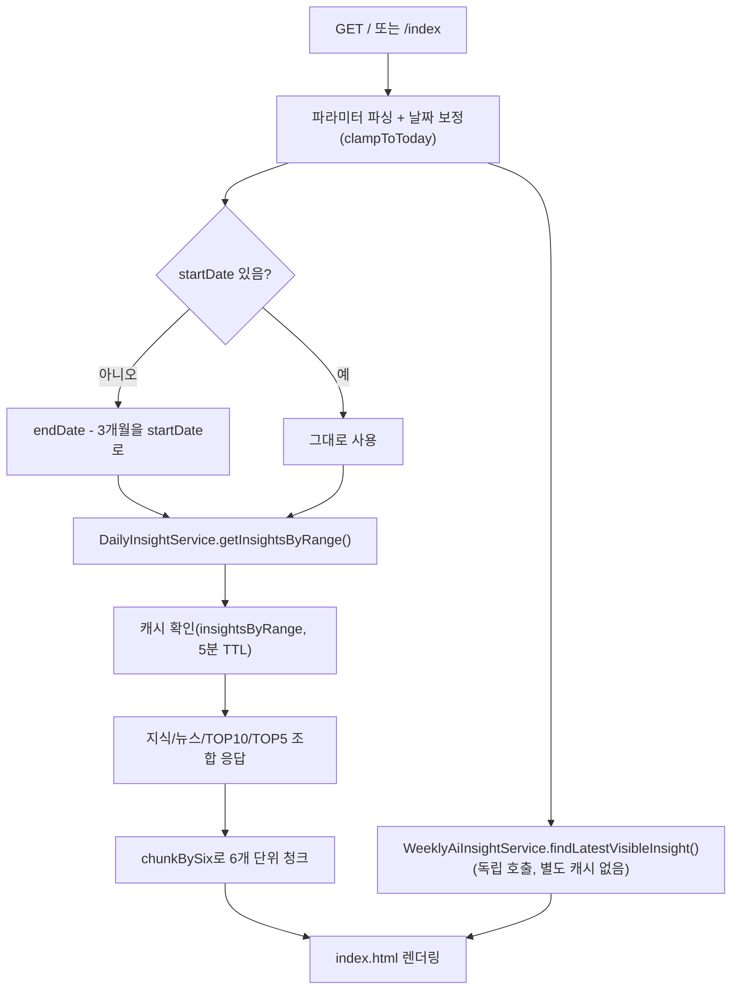

# Unit 1: 홈/인사이트 목록 — Compact Card

> **Project**: dailyDevInsight | **Date**: 2026-08-05 | **문서 유형**: 1차 Compact Card (정밀화 안 됨)
> Phase 1 / `docs/01-plan/features/full-documentation-initiative.md` §2.2-1

## ① 목적

메인 화면에서 대표 지식 콘텐츠 1건 + 뉴스 리스트 + 주간 TOP(조회수 기준) + 주간 AI 인사이트를 한 번에 노출한다. 날짜/기간/키워드로 필터링 가능.

## ② 관련 파일

- `InsightPageController` (`index()`)
- `DailyInsightRestController` (`/api/insights`)
- `DailyInsightService`, `DailyKnowledgeService`, `TechNewsService`
- `DailyInsightResponseDTO`, `DailyInsightDTO`
- `WeeklyAiInsightService`(주간 AI 인사이트 섹션 연동)
- `templates/index.html`

## ③ 진입 엔드포인트

| Method | Path | 용도 |
|---|---|---|
| GET | `/`, `/index` | 화면 렌더링 (MVC) |
| GET | `/api/insights?date=` | 단일 날짜 기준 JSON 조회 (REST, 화면과 별개 경로) |

## ④ 핵심 호출 흐름

1. `date`/`startDate`/`endDate`/`keyword`/`searchType` 파라미터 파싱, 미래 날짜는 오늘로 보정(`clampToToday`)
2. `startDate` 없으면 `endDate - 3개월`을 기본 범위로 사용
3. `DailyInsightService.getInsightsByRange()` 호출 → 지식 콘텐츠(기간+키워드 필터), 뉴스(종료일 기준), 주간 TOP10/TOP5(조회수 기준) 조합
4. 지식/뉴스 리스트를 6개 단위로 청크(`chunkBySix`)해 카드 그리드 렌더링용으로 모델에 추가
5. `WeeklyAiInsightService.findLatestVisibleInsight()`로 주간 AI 인사이트 섹션 데이터 별도 조회 (getInsightsByRange와 무관한 독립 호출)

### 처리 흐름도

## ⑤ 데이터/외부 연동

- `DailyKnowledge`, `TechNews` 엔티티 조회 (검색은 지식에만 적용, 뉴스는 검색 대상 아님)
- 주간 TOP10/TOP5: 기준일이 속한 **월~일 주간** 구간에서 `viewCount` 내림차순 (지식 콘텐츠만 집계, 뉴스는 제외)
- 외부 API 연동 없음 (읽기 전용 조회만)

## ⑥ 인증·트랜잭션·캐시

- 인증: 로그인 필요 화면(`SecurityConfig`가 이 경로를 보호 — Unit 8에서 상세 확인 예정)
- 트랜잭션: `DailyInsightService` **클래스 전체가 `@Transactional(readOnly = true)`**
- 캐시: `getInsightsByDate`/`getInsightsByRange`/`findWeeklyHotKnowledgeTop5`/`findWeeklyHotKnowledgeTop10` 전부 `@Cacheable` 적용 (Redis, TTL은 Unit 9 참조) — ⑧ 정정 사항 참고

## ⑦ 화면 요약

- 대표 지식 1건 + 뉴스 리스트 + 주간 TOP10/TOP5 + "이번 주 개발 Trend"(주간 AI 인사이트, `visible=true`인 최신 1건만) 섹션
- 검색바(키워드+검색타입), 날짜 범위 선택 UI

## ⑧ 패턴 특이사항

- **뉴스 조회는 `/api/insights`(REST)와 `/`(MVC) 경로가 서로 다른 서비스 메서드(`getInsightsByDate` vs `getInsightsByRange`)를 호출** — 전자는 단일일 기준 최근 2~3일 fallback 로직(`TechNewsService.findNewsByDate` 내부, 6건 미만이면 3일로 확장) 그대로 적용되지만, 화면(MVC)에서는 `endDate`만 넘겨 사실상 같은 로직을 타되 파라미터 해석 경로가 다름 → 두 엔드포인트의 뉴스 결과가 항상 동일하다고 가정하면 안 됨
- ~~`Top10`은 캐시 안 되고 `Top5`만 캐시됨~~ **[정정, 0.2] Top10도 `@Cacheable(CACHE_WEEKLY_TOP10)` 적용되어 있음 — 최초 조사 시 `grep -A`로 메서드 선언부만 보고 바로 위 어노테이션 줄을 놓친 오류였음. Unit 9(캐시 정책) 작성 중 `RedisCacheConfig`를 다시 보다가 발견해 정정함. Top10 TTL 20분, Top5도 20분으로 동일**
- `weeklyAiInsight`는 `getInsightsByRange`와 별개 트랜잭션/서비스 호출로 붙어있어, 인사이트 목록 캐시가 갱신돼도 주간 AI 인사이트는 별도로 갱신됨

## ⑨ 알아둘 점 / 리스크

- 검색은 지식 콘텐츠에만 적용되고 뉴스는 검색 대상이 아님 (`MVP_SCOPE.md`에 이미 명시된 제약, 코드로 재확인됨)
- `startDate`가 `endDate`보다 미래면 서버에서 swap 처리(에러 아님) — 사용자에게 별도 안내 없음
- 승격 조건(§2.4) 해당 없음 — 현재 compact card 단계 유지

---

## Version History

| Version | Date | Changes |
|---|---|---|
| 0.1 | 2026-08-05 | 최초 작성 (1차 사이클 compact card) |
| 0.2 | 2026-08-06 | Top10 캐시 오류 정정, 처리 흐름도(Mermaid) 추가 |
