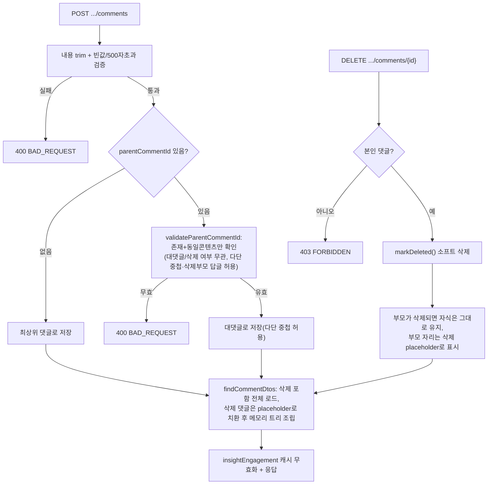

# Unit 4: 댓글/대댓글 — Compact Card (Delta of Unit 2)

> **Project**: dailyDevInsight | **Date**: 2026-08-05 | **문서 유형**: 1차 Compact Card
> **기준 문서**: `docs/02-design/features/insight-detail.md` (Unit 2) — 컨트롤러/서비스/캐시 정책 전체 공유. 여기서는 댓글 고유 부분만 기록

## ① 목적

지식/뉴스 콘텐츠에 대한 댓글 작성, 대댓글(1단계) 작성, 본인 댓글 삭제.

## ② 관련 파일

- `InsightDetailRestController.addComment()` / `deleteComment()`
- `InsightDetailService.addComment()` / `deleteComment()` / `validateParentCommentId()` / `findCommentDtos()` / `isDeletedComment()`
- Entity: `InsightComment` (`parentCommentId`로 대댓글 표현, `isDeleted` 소프트 삭제 플래그)
- Repository: `InsightCommentRepository` (`findByContentTypeAndContentIdOrderByCreatedAtAsc` — 삭제 포함 전체 조회, 2026-08-07 추가)
- DTO: `InsightCommentDTO`(응답, `replies` 필드로 트리 구조, `deleted` 필드로 삭제 placeholder 여부 표시), `InsightCommentRequestDTO`(요청)

## ③ 진입 엔드포인트

Unit 2 §3 참조 (`POST /comments`, `DELETE /comments/{commentId}`)

## ④ 핵심 호출 흐름

1. 내용 검증: trim 후 빈 값이면 400, 500자 초과 400 (`MAX_COMMENT_LENGTH`)
2. 대댓글이면 `parentCommentId`가 같은 콘텐츠에 속하는 댓글인지만 검증 — **[2026-08-07, F-05 정책 확정]** 다단 중첩 허용이 확정되어 부모가 대댓글이든 삭제된 댓글이든 관계없이 답글을 달 수 있다(`validateParentCommentId`가 `findById` + 콘텐츠 일치만 확인, 삭제 여부는 더 이상 걸러내지 않음 — 삭제된 댓글에도 답글 가능해야 하기 때문)
3. 목록 조회 시 전체 댓글(삭제 포함)을 가져와 **메모리에서** `parentCommentId` 기준 트리 조립(`findCommentDtos`) — DB 재귀 쿼리 아님. **[2026-08-07, F-15 정책 확정]** 삭제된 댓글도 트리에 placeholder(`content="삭제된 댓글입니다."`, `authorName="삭제된 사용자"`, `deleted=true`)로 포함되어 자식이 원래 위치를 유지함
4. 삭제는 본인 댓글만 가능(`FORBIDDEN` 403), 물리 삭제 아닌 `markDeleted()` 소프트 삭제

### 처리 흐름도

## ⑤~⑥ 데이터/인증/트랜잭션/캐시

Unit 2와 완전히 동일.

## ⑧ 패턴 특이사항

- **[2026-08-07, F-05 정책 확정 및 구현 완료] 다단 중첩(대댓글의 대댓글)을 정책적으로 허용** — 서버(`validateParentCommentId`)와 프론트(`insight-detail.js`의 `buildCommentHtml()` 재귀 렌더링) 모두 깊이 제한 없이 허용. 다만 화면 들여쓰기는 CSS `depth-N`(N=0~4) 클래스 + `.depth-4 .depth-4 { margin-left: 0 }` 트릭으로 5단계부터 시각적으로 고정(무한 들여쓰기 방지). MVP_SCOPE.md의 "대댓글까지만"이라는 이전 기술은 이 정책 확정으로 폐기되었고 §2.2에 반영 완료
- 댓글 목록 조립이 재귀 쿼리가 아니라 전체 로드 후 메모리 트리 구성 — **[2026-08-06 재검토, P1-4]** 알고리즘 자체는 콘텐츠당 쿼리 2회(댓글 조회 1회 + 작성자 이름 배치 조회 1회) + `HashMap` 기반 O(n) 단일 패스 조립으로, N+1 문제는 없음(재귀 쿼리로 바꿔도 이득이 없는 구조). 대신 `findByContentTypeAndContentIdAndIsDeletedOrderByCreatedAtAsc` 쿼리에 `(content_type, content_id, is_deleted)` 복합 인덱스가 없어 Oracle이 풀스캔할 수 있었던 실제 병목을 코드/스키마 조사로 확인 — `OracleSchemaMigrationRunner`에 `idx_insight_comment_content` 인덱스 추가로 해결. 댓글 수 자체의 무제한 페이지네이션/depth 제한 도입(F-16 권장사항)은 데이터 증가 추이를 보며 재검토(Phase 1 범위 밖으로 유지). **[2026-08-07]** F-15 구현으로 `findCommentDtos`가 이제 삭제 댓글까지 전체 조회하므로(`findByContentTypeAndContentIdOrderByCreatedAtAsc`, isDeleted 필터 없음) 로드량이 소폭 늘었으나 쿼리 횟수·인덱스 활용 구조는 동일하게 유지됨
- **[2026-08-07, F-17 정책 확정 및 구현 완료] SSR이 대댓글까지 재귀 렌더링** — `insight-detail.html`이 Thymeleaf 재귀 fragment(`commentItem(comment, depth)`)로 전환되어 최초 로드 시에도 전체 댓글 트리가 서버에서 렌더링됨. JS(`buildCommentHtml`)와 SSR 양쪽이 동일한 `class`/`data-*` 구조를 생성하도록 맞춰짐(재작성 후 재렌더링해도 DOM 구조 불일치 없음)

## ⑨ 알아둘 점 / 리스크

- **[2026-08-07, F-15 정책 확정 및 구현 완료]** 삭제된 댓글은 자식 유무와 관계없이 항상 placeholder(`"삭제된 댓글입니다."`, 작성자 `"삭제된 사용자"`)로 표시되며, 원본 내용/작성자명은 API 응답에도 포함되지 않음(`isDeletedComment()`로 서버에서 치환 후 응답). 삭제된 댓글에는 삭제 버튼만 숨기고 답글 작성은 계속 허용(스레드 단절 방지, 설계 시 판단)
- `countTotalComments()`(JS)는 삭제 placeholder도 댓글 수에 포함 — 별도 정책 결정 없어 최소 변경 원칙으로 그대로 유지됨(`insight-comment.md` §⑩ Out of Scope 참조)
- 댓글 수정 기능 없음 (MVP_SCOPE.md에 이미 명시된 제약)

---

## ⑩ Phase 2 UX 개선 설계 (F-05 / F-15 / F-17) — 구현·검증 완료

> **Status**: ✅ 구현·검증 완료 (2026-08-07)
> **정책 결정 근거**: `docs/01-plan/features/service-quality-roadmap.md` §2.1 Phase 2 (2026-08-07, 사용자 승인)
> **담당**: 구현 = Codex(`codex exec -s danger-full-access`), 검증 = Claude(`git diff` 전체 리뷰 + `./gradlew test --rerun` 독립 실행, 68 tests/0 failures 확인)
> **파일럿 상세**: `docs/01-plan/features/codex-collab-workflow.md` §7~7.1

### 목적

Phase 2에서 결정된 3건(다단 중첩 허용 확정, 삭제된 부모 댓글 placeholder 표시, SSR 재귀 렌더링)을 하나의 응집된 변경 단위로 구현한다. 세 항목 모두 같은 파일군(`InsightComment*`, `insight-detail.*`)을 건드리므로 함께 진행한다.

### 변경 대상 파일

| 파일 | 변경 내용 |
|---|---|
| `backend/src/main/java/com/dailydevinsight/repository/InsightCommentRepository.java` | 삭제 여부 무관 전체 조회 쿼리 메서드 추가 |
| `backend/src/main/java/com/dailydevinsight/service/InsightDetailService.java` | `findCommentDtos()` 로직 변경 (전체 로드 + 삭제 댓글 placeholder 처리) |
| `backend/src/main/java/com/dailydevinsight/dto/InsightCommentDTO.java` | `deleted` 필드 추가 |
| `backend/src/main/resources/templates/insight-detail.html` | 댓글 재귀 렌더링용 Thymeleaf fragment 도입 |
| `backend/src/main/resources/static/js/insight-detail.js` | `buildCommentHtml()`에 삭제 표시·depth cap 반영 (SSR과 동일 구조 유지) |
| `backend/src/main/resources/static/css/insight-detail.css` | depth cap 스타일, 삭제된 댓글 스타일 추가 |

### F-05. 다단 중첩 — 서버/JS 로직 변경 없음, 시각적 depth cap만 추가

- 서버(`validateParentCommentId`)와 JS(`buildCommentHtml` 재귀)는 이미 무제한 중첩을 허용하고 있으므로 **막지 않는다** (정책이 "허용"이므로 그대로 유지).
- 단, 현재 CSS(`comment-item-reply { margin-left: 18px }`)가 중첩 `<ul>` 구조상 깊이마다 누적 적용되어 깊은 스레드에서 들여쓰기가 무한정 늘어난다 — 이것만 고친다.
- **설계**: `buildCommentHtml(comment, depth)`가 만드는 `<li>` 클래스에 `depth-N` 클래스를 추가하되, `N = Math.min(depth, 4)`로 캡핑한다 (`depth-0`~`depth-4`, 5단계부터는 `depth-4`로 고정). SSR fragment도 동일하게 `depth`를 파라미터로 받아 같은 캡핑 로직 적용.
- CSS: `.depth-1`~`.depth-4`에 단계별 `margin-left`(예: 14px/28px/42px/56px) 정의, 4단계 이상은 `.depth-4` 값 재사용. 기존 `.comment-item-reply`는 "답글 스타일(테두리색 등)" 용도로 depth와 별개로 유지해도 됨.

### F-15. 삭제된 부모 댓글 — Placeholder로 유지 (전부 통일, leaf 여부 무관)

- **규칙(단순화 원칙)**: 삭제된 댓글은 자식 유무와 관계없이 **항상 placeholder로 표시**한다. "자식이 없는 삭제 댓글은 완전히 숨김" 같은 조건부 처리는 도입하지 않는다 — 트리 조립 로직을 단순하게 유지하기 위한 선택.
- **Repository**: `findByContentTypeAndContentIdOrderByCreatedAtAsc(String contentType, Long contentId)` 추가 (isDeleted 조건 없이 전체 조회). 기존 `findByContentTypeAndContentIdAndIsDeletedOrderByCreatedAtAsc`는 그대로 유지(다른 곳에서 안 쓰이면 유지만, 삭제하지 않음 — 범위 밖).
- **Service (`findCommentDtos`)**:
  - 위 신규 쿼리로 삭제 포함 전체 댓글을 로드해 트리를 조립한다(기존 `COMMENT_ACTIVE` 필터링 제거).
  - 댓글이 `isDeleted == 1`이면 DTO 생성 시: `content` → 고정 문구 `"삭제된 댓글입니다."`, `authorName` → `"삭제된 사용자"`, `mine` → 항상 `false`, `deleted` → `true`. (원본 내용/작성자명은 응답에 포함하지 않는다 — 클라이언트로 원본 유출 방지)
  - 살아있는 댓글은 기존과 동일하게 `deleted=false`.
- **DTO**: `InsightCommentDTO`에 `private boolean deleted;` 필드 추가.
- **Frontend 표시 규칙** (SSR/JS 공통):
  - `comment.deleted === true`이면 답글 버튼(`data-comment-reply`)과 삭제 버튼(`data-comment-delete`)을 렌더링하지 않는다(답글은 달 수 있게 둘지, 막을지 → **막지 않음**: 삭제된 댓글에도 답글 작성은 허용해 대화 스레드가 끊기지 않게 한다. 단 삭제 버튼은 당연히 숨김).
  - `<li>` 클래스에 `comment-item-deleted` 추가 → CSS로 회색조 처리.
- **CSS**: `.comment-item-deleted { color/opacity 조정 등 }` — 구체 톤은 기존 팔레트에 맞춰 자유롭게 정하되 "삭제됨"이 시각적으로 구분되면 됨.

### F-17. SSR 재귀 렌더링

- `insight-detail.html`의 댓글 목록 부분을 Thymeleaf 재귀 fragment로 전환한다. 최상위 `th:each="comment : ${detail.comments}"`에서 fragment를 호출하고, fragment 내부에서 `comment.replies`에 대해 자기 자신을 재귀 호출한다.
- **필수 제약**: SSR이 최초 렌더링하는 DOM 구조(`class`, `data-*` 속성)는 JS의 `buildCommentHtml()`이 생성하는 구조와 **동일해야 한다** — 댓글 작성/삭제 후 JS가 `renderComments()`로 전체를 다시 그리므로, 두 렌더링 경로가 다르면 첫 로드와 상호작용 후 화면이 미묘하게 달라진다. F-05(depth 클래스)·F-15(deleted 클래스/문구) 규칙을 SSR fragment와 JS 양쪽에 동일하게 반영할 것.
- 빈 댓글 목록 처리(`등록된 댓글이 없습니다`)는 기존 로직 유지.

### 수용 기준 (Acceptance Criteria) — 2026-08-07 전부 충족 확인(Claude 검증)

- [x] 대댓글의 대댓글(3단계 이상)을 작성해도 서버가 막지 않고 정상 저장된다 — `InsightDetailServiceTest.addComment_ShouldAllowThirdLevelReply`
- [x] 5단계 이상 중첩해도 화면 들여쓰기가 특정 단계 이상 늘어나지 않는다(depth cap 동작) — CSS `.depth-4 .depth-4 { margin-left:0 }` + JS `Math.min(depth,4)`, `InsightPageControllerTest`에서 `li.depth-4` 2건(4/5단계) 확인
- [x] 자식이 있는 댓글을 삭제하면, 그 자리에 "삭제된 댓글입니다."가 표시되고 자식은 원래 위치(들여쓰기)에 그대로 남는다 — `InsightDetailServiceTest.getEngagementOnly_ShouldKeepDeletedCommentsAsPlaceholders`
- [x] 삭제된 댓글에는 삭제 버튼이 없고, 답글 작성은 여전히 가능하다 — `addComment_ShouldAllowReplyToDeletedParent`, 템플릿/JS 조건부 렌더링
- [x] 삭제된 댓글의 원본 내용/작성자명이 API 응답(`GET` 상세 조회 포함)에 노출되지 않는다 — 서버에서 항상 치환 후 응답(원본 텍스트는 DTO에 담기지 않음)
- [x] 페이지를 새로고침(SSR 최초 로드)했을 때와 댓글 작성/삭제 후(JS 재렌더링) 화면 구조가 동일하다 — SSR fragment와 JS `buildCommentHtml`이 동일한 class/data-* 생성 규칙 공유
- [x] 기존 테스트(`./gradlew test`) 전부 통과 + 위 시나리오에 대한 신규/수정 테스트 추가 — **68 tests, 0 failures, 0 errors** (Claude가 JDK 21로 독립 재실행하여 확인, Codex 자체 보고와 일치)

### Out of Scope

- F-16(댓글 페이지네이션/depth 제한) — Phase 1에서 이미 범위 밖으로 유지 결정됨, 이번 변경에도 포함하지 않음
- 댓글 수정 기능 — MVP_SCOPE.md 기준 범위 밖
- `countTotalComments()`가 삭제된 placeholder도 댓글 수에 포함시키는 현재 동작은 그대로 유지(별도 정책 결정 없었음, 최소 변경 원칙)

---

## Version History

| Version | Date | Changes |
|---|---|---|
| 0.1 | 2026-08-05 | 최초 작성 (1차 사이클 compact card, Unit 2 delta) |
| 0.2 | 2026-08-06 | 다단 대댓글 허용 사실 정정(Unit 2 정밀화 반영), 처리 흐름도(Mermaid) 추가 |
| 0.3 | 2026-08-06 | Phase 1(P1-4) 반영 — 성능 재검토 결과(알고리즘은 이미 O(n), 실제 병목은 누락된 복합 인덱스) 기록, `idx_insight_comment_content` 인덱스 추가 |
| 0.4 | 2026-08-07 | Phase 2 정책 결정(F-05/F-15/F-17) 반영 — Codex 구현용 상세 설계(⑩) 추가. `codex-collab-workflow.md` 파이프라인 첫 파일럿 대상 |
| 0.5 | 2026-08-07 | 구현·검증 완료 반영 — Codex 구현(`danger-full-access`) + Claude 독립 검증(68 tests 통과) 확인. ④/⑧/⑨ 본문을 실제 구현 결과에 맞게 갱신, ⑩ 수용 기준 전부 체크 |
