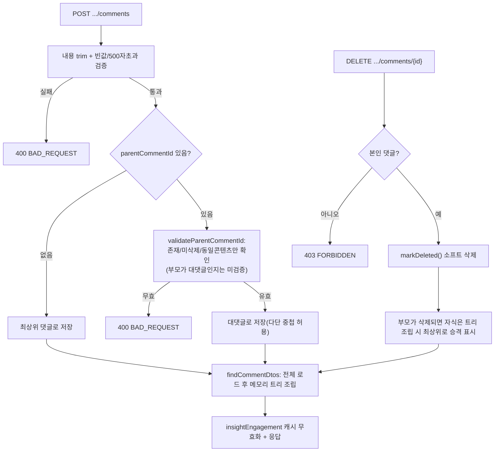

# Unit 4: 댓글/대댓글 — Compact Card (Delta of Unit 2)

> **Project**: dailyDevInsight | **Date**: 2026-08-05 | **문서 유형**: 1차 Compact Card
> **기준 문서**: `docs/02-design/features/insight-detail.md` (Unit 2) — 컨트롤러/서비스/캐시 정책 전체 공유. 여기서는 댓글 고유 부분만 기록

## ① 목적

지식/뉴스 콘텐츠에 대한 댓글 작성, 대댓글(1단계) 작성, 본인 댓글 삭제.

## ② 관련 파일

- `InsightDetailRestController.addComment()` / `deleteComment()`
- `InsightDetailService.addComment()` / `deleteComment()` / `validateParentCommentId()` / `findCommentDtos()`
- Entity: `InsightComment` (`parentCommentId`로 대댓글 표현, `isDeleted` 소프트 삭제 플래그)
- Repository: `InsightCommentRepository`
- DTO: `InsightCommentDTO`(응답, `replies` 필드로 트리 구조), `InsightCommentRequestDTO`(요청)

## ③ 진입 엔드포인트

Unit 2 §3 참조 (`POST /comments`, `DELETE /comments/{commentId}`)

## ④ 핵심 호출 흐름

1. 내용 검증: trim 후 빈 값이면 400, 500자 초과 400 (`MAX_COMMENT_LENGTH`)
2. 대댓글이면 `parentCommentId`가 같은 콘텐츠에 속하고 삭제되지 않은 댓글인지 검증 — **대댓글의 대댓글(2단계)은 서버가 별도로 막지 않음**, `validateParentCommentId`는 부모가 존재/미삭제/동일 콘텐츠인지만 확인하고 부모 자체가 대댓글인지는 체크 안 함
3. 목록 조회 시 전체 댓글을 가져와 **메모리에서** `parentCommentId` 기준 트리 조립(`findCommentDtos`) — DB 재귀 쿼리 아님, 댓글 수가 많아지면 매 요청마다 전체 로드
4. 삭제는 본인 댓글만 가능(`FORBIDDEN` 403), 물리 삭제 아닌 `markDeleted()` 소프트 삭제

### 처리 흐름도

## ⑤~⑥ 데이터/인증/트랜잭션/캐시

Unit 2와 완전히 동일.

## ⑧ 패턴 특이사항

- **[정정, Unit 2 정밀화 중 확인] "대댓글까지만 지원"이 서버와 프론트 양쪽 모두에서 강제되지 않음** — `validateParentCommentId`가 부모의 `parentCommentId`가 null인지 확인하지 않고, `insight-detail.js`의 `buildCommentHtml()`도 `depth`와 무관하게 모든 댓글(대댓글 포함)에 답글 버튼과 입력 폼을 렌더링함(재귀 호출, depth 제한 없음). **즉 대댓글에 대댓글을 다는 게 UI에서도 실제로 가능** — MVP_SCOPE.md의 "대댓글까지만" 기술은 현재 구현과 다름(문서-코드 불일치, F-05로 findings 문서 갱신 필요)
- 댓글 목록 조립이 재귀 쿼리가 아니라 전체 로드 후 메모리 트리 구성 — 데이터 양이 커지면 성능 이슈 후보

## ⑨ 알아둘 점 / 리스크

- 삭제된 댓글도 자식(대댓글)이 있으면 트리 구조상 부모 슬롯은 유지될 것으로 보이나, `isDeleted` 댓글이 화면에 어떻게 표시되는지는 템플릿 확인 필요(착수 시 확인)
- 댓글 수정 기능 없음 (MVP_SCOPE.md에 이미 명시된 제약)

---

## Version History

| Version | Date | Changes |
|---|---|---|
| 0.1 | 2026-08-05 | 최초 작성 (1차 사이클 compact card, Unit 2 delta) |
| 0.2 | 2026-08-06 | 다단 대댓글 허용 사실 정정(Unit 2 정밀화 반영), 처리 흐름도(Mermaid) 추가 |
