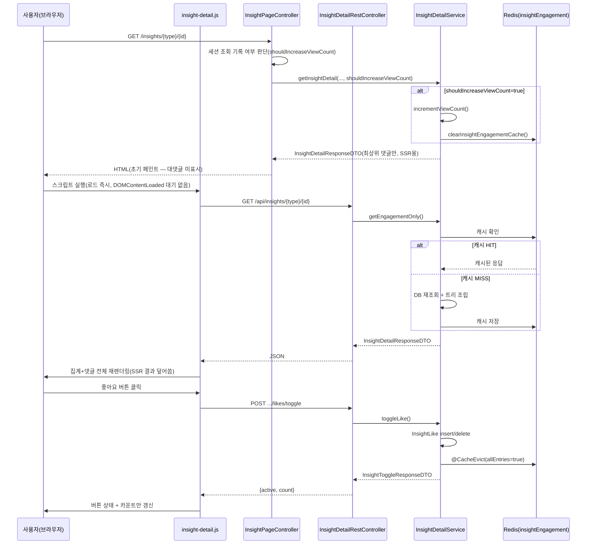

# 인사이트 상세(좋아요·북마크·댓글) Design Document

> **Summary**: 지식/뉴스 콘텐츠 상세 조회 + 조회수 집계 + 좋아요/북마크/댓글(대댓글) 상호작용을 하나의 컨트롤러·서비스가 처리하는 기능
>
> **Project**: dailyDevInsight
> **Date**: 2026-08-06
> **Status**: **Implemented (사후 문서화, 2차 사이클 정밀화)** — 1차 사이클 compact card를 기준으로 확장. SoR: 코드 우선
> **Unit 3(좋아요/북마크)·Unit 4(댓글/대댓글)는 이 문서를 기준 문서로 참조**(`docs/02-design/features/insight-like-bookmark.md`, `insight-comment.md`)

---

## Context Anchor

| Key | Value |
|-----|-------|
| **WHY** | 콘텐츠 소비 후 사용자 반응(좋아요/북마크/댓글)을 남길 수 있는 유일한 진입점 |
| **WHO** | 인증된 사용자만 (좋아요/북마크/댓글은 401로 차단, 조회는 인증 화면 하위) |
| **RISK** | 캐시 무효화가 `allEntries=true`(전체 삭제)라 트래픽 증가 시 캐시 효율 저하, 다단 대댓글이 서버/프론트 양쪽에서 차단되지 않음 |
| **SUCCESS** | 조회수 세션당 1회 반영, 좋아요/북마크 토글, 댓글/대댓글 작성·삭제가 새로고침 없이 정상 동작 |
| **SCOPE** | 상세 조회 + 좋아요/북마크 + 댓글/대댓글. 콘텐츠 CRUD(Unit 15)는 범위 밖 |

---

## 1. Overview

### 1.1 목적

`InsightDetailService` 하나가 지식/뉴스 상세 조회, 조회수 집계, 좋아요/북마크 토글, 댓글(대댓글 포함) CRUD를 전부 처리한다. `InsightContentType` enum(`KNOWLEDGE`/`NEWS`)으로 콘텐츠 타입을 다형적으로 처리.

### 1.2 배경

`docs/MVP_SCOPE.md` §2.1·§2.2에 이미 구현 완료로 기재된 기능. 1차 사이클(compact card, 2026-08-05)에서 Unit 2/3/4로 나눠 가볍게 문서화했고, Unit 2가 §2.4 승격 기준(6개 저장소 결합·Unit 3/4의 의존 대상)에 해당해 정밀 문서로 승격됨.

### 1.3 관련 파일

| 레이어 | 파일 |
|--------|------|
| Controller | `InsightPageController.insightDetail()`(화면), `InsightDetailRestController`(`/api/insights/{type}/{id}/**`) |
| Service | `InsightDetailService` |
| Entity | `InsightLike`, `InsightBookmark`, `InsightComment` |
| Repository | `InsightLikeRepository`, `InsightBookmarkRepository`, `InsightCommentRepository`, `DailyKnowledgeRepository`, `TechNewsRepository`, `UserRepository` |
| DTO | `InsightDetailResponseDTO`, `InsightToggleResponseDTO`, `InsightCommentDTO`, `InsightCommentRequestDTO` |
| Template/JS | `templates/insight-detail.html`, `static/js/insight-detail.js` — 상세는 화면설계 문서(`docs/02-design/screens/insight-detail.md`) 참조 |
| Test | `test/.../InsightDetailRestControllerTest.java` (컨트롤러 레벨 4건, 서비스 유닛 테스트 없음) |

---

## 2. Data Model

### 2.1 Entity 개요

| Entity | 핵심 필드 | 비고 |
|---|---|---|
| `InsightLike` | `contentType`, `contentId`, `userId` | 복합 유니크(추정), 해제 시 row 자체 삭제 — 이력 미보존 |
| `InsightBookmark` | `contentType`, `contentId`, `userId` | `InsightLike`와 동일 구조·로직(중복 구현) |
| `InsightComment` | `contentType`, `contentId`, `userId`, `content`, `parentCommentId`, `isDeleted`, `createdAt` | `parentCommentId`가 null이면 최상위 댓글, 아니면 대댓글. 소프트 삭제(`isDeleted`) |

### 2.2 콘텐츠 타입 다형 처리

`InsightContentType.from(String)`으로 `type` 경로 파라미터를 `KNOWLEDGE`/`NEWS`로 해석. 이후 `switch (contentType)` 패턴으로 대상 Repository(`DailyKnowledgeRepository`/`TechNewsRepository`)를 분기 — 별도 공통 인터페이스 없이 `switch` 문으로 다형성 구현(record `InsightBaseData`로 결과만 통일).

---

## 3. 동작 명세

### 3.1 Endpoints

| Method | Path | 설명 | 인증 |
|--------|------|------|------|
| GET | `/insights/{type}/{id}` | 화면 렌더링(MVC) + 조회수 세션당 1회 증가 | 필요 |
| GET | `/api/insights/{type}/{id}` | 집계 상태 조회(REST, 캐시됨, 조회수 증가 없음) | 필요 |
| POST | `/api/insights/{type}/{id}/likes/toggle` | 좋아요 토글 | 필요 |
| POST | `/api/insights/{type}/{id}/bookmarks/toggle` | 북마크 토글 | 필요 |
| POST | `/api/insights/{type}/{id}/comments` | 댓글/대댓글 등록 | 필요 |
| DELETE | `/api/insights/{type}/{id}/comments/{commentId}` | 본인 댓글 소프트 삭제 | 필요 |

### 3.2 처리 흐름도

### 3.3 핵심 로직 상세

1. **조회수 증가**: 세션 키 `insight:viewed:{type}:{id}`로 중복 방지 — **[Codex 검증 발견] `type`을 정규화(소문자화 등)하기 전 원본 문자열을 그대로 키에 사용. `InsightContentType.from()`은 대소문자 무시하고 해석하므로, 같은 콘텐츠를 `knowledge`와 `KNOWLEDGE` 등 다른 대소문자 경로로 접근하면 서로 다른 세션 키가 생성되어 조회수가 중복 증가할 수 있음**. 증가 시 `dailyKnowledgeRepository.incrementViewCount()`/`techNewsRepository.incrementViewCount()`(UPDATE 쿼리, `updatedCount==0`이면 404) 호출 후 **`insightEngagement` 캐시 전체 clear** — 이 clear는 `@CacheEvict` 어노테이션이 아니라 `CacheManager.getCache(...).clear()`를 코드에서 직접 호출하는 방식(다른 4개 메서드와 무효화 구현 방식이 다름)
2. **좋아요/북마크 토글**: `findByContentTypeAndContentIdAndUserId` 존재 여부로 insert/delete, 이후 `countByContentTypeAndContentId`로 최신 카운트 반환. 좋아요/북마크는 완전히 동일한 로직이 두 서비스 메서드에 중복 구현됨. **응답은 카운트만 반환하며, 화면은 이 응답으로 버튼/카운트만 갱신하고 댓글 재조회는 트리거하지 않음(§4 UI/UX 참조)**
3. **댓글 등록**: 내용 검증(trim, 빈값/500자 초과 400) → `parentCommentId` 있으면 부모 존재/미삭제/동일콘텐츠 검증(`validateParentCommentId`, **부모가 대댓글인지는 검증 안 함** — §8 참조) → 저장
4. **댓글 목록 조립**: 전체 댓글을 한 번에 로드 후 **메모리에서** `parentCommentId` 기준 트리 구성(`findCommentDtos`). DB 재귀 쿼리 아님. **[Codex 검증 발견] 페이지네이션·depth 제한이 전혀 없어, 댓글이 많거나 깊게 중첩될수록 매 조회마다 전체 로드+캐시+직렬화 비용이 커짐**
5. **댓글 삭제**: 본인 확인(`userId` 불일치 시 403) 후 `markDeleted()`로 소프트 삭제. **[Codex 검증 발견] 부모 댓글을 삭제해도 자식(대댓글)은 삭제되지 않음 — 트리 조립 시 삭제된 부모의 DTO가 존재하지 않으므로, 그 자식 댓글들이 화면상 최상위 댓글처럼 표시(승격)됨.** 별도의 "삭제된 부모" placeholder 없음
6. **`getEngagementOnly()`라는 메서드명과 달리 실제로는 제목·본문·댓글 전체를 포함한 완전한 `InsightDetailResponseDTO`를 생성해 캐시함** — 이름이 실제 반환 범위를 정확히 반영하지 않음(Codex 검증에서 발견)

---

## 4. UI/UX

화면 상세는 `docs/02-design/screens/insight-detail.md` 참조. 핵심 요지:
- SSR은 **최상위 댓글만** 표시(대댓글 미표시), JS 재조회 후 대댓글까지 포함한 전체 트리로 확장됨
- 좋아요/북마크는 **부분 갱신**(버튼+카운트만), 댓글 등록/삭제는 **전체 재렌더링**(`renderFromState`) — 액션 종류에 따라 갱신 범위가 다름 (초안 작성 시 "모든 상호작용이 재조회 경로로 통일"이라 잘못 서술했던 부분을 Codex 검증으로 정정)

---

## 5. Error Handling

| 상황 | 처리 |
|------|------|
| 잘못된 `type` 경로 파라미터 | `ResponseStatusException(BAD_REQUEST)` |
| 비로그인 상태에서 좋아요/북마크/댓글 액션 | `ResponseStatusException(UNAUTHORIZED)` |
| 존재하지 않는 콘텐츠 ID | `ResponseStatusException(NOT_FOUND)` |
| 댓글 내용 공백/500자 초과 | `ResponseStatusException(BAD_REQUEST)` |
| 유효하지 않은 부모 댓글(존재하지 않음/삭제됨/다른 콘텐츠) | `ResponseStatusException(BAD_REQUEST)` |
| 본인 아닌 댓글 삭제 시도 | `ResponseStatusException(FORBIDDEN)` |
| 프론트: 위 예외 발생 시 | `insight-detail.js`가 응답 body의 `message`를 그대로 `window.alert()`로 노출 |

> **패턴 특이사항**: 이 unit은 `ResponseStatusException`으로 HTTP 상태코드를 직접 던지는 방식인데, `AdminPageController` 계열은 광범위 `catch(Exception)`+flash 방식(findings F-03 참조) — 프로젝트 내 예외 처리 스타일이 통일되어 있지 않음.

---

## 6. Security Considerations

- 좋아요/북마크/댓글 엔드포인트는 `resolveUserId()`에서 로그인 여부를 즉시 검증(비로그인 시 401)
- CSRF 토큰이 `<meta>` 태그로 노출되고 JS가 모든 쓰기 요청 헤더에 첨부
- 댓글 내용은 서버에서 별도 HTML sanitize 없이 저장되지만, 화면 출력은 `insight-detail.js`의 `escapeHtml()`이 담당(Thymeleaf `th:text` 대신 JS가 렌더링하는 구조라 서버 템플릿 엔진의 자동 이스케이프에 의존하지 않고 별도 구현) — **[Codex 검증 정정] 이스케이프 대상은 `&`, `<`, `>`, `"`, `'` 5개 문자**(최초 작성 시 "4개"로 오기재했던 것을 정정). HTML 태그·속성 인젝션 관점에서는 커버되나 완전한 sanitize 라이브러리는 아님

---

## 7. 테스트 현황

`InsightDetailRestControllerTest`에 컨트롤러 레벨 4개 테스트 존재: 집계 조회, 좋아요 토글, 댓글 등록, 댓글 삭제.

**커버 안 된 케이스**: 북마크 토글, 대댓글(부모 지정) 등록, 다단 대댓글 시나리오, 인증 실패(401), 존재하지 않는 콘텐츠(404), 타인 댓글 삭제(403), `InsightDetailService` 자체의 유닛 테스트(현재는 컨트롤러 레벨 + 서비스 mock뿐).

---

## 8. Known Gaps / 후속 작업 후보

- **다단 대댓글이 서버·프론트 양쪽에서 차단되지 않음**(findings F-05) — 정책 결정 필요, `MVP_SCOPE.md`의 "대댓글까지만" 기술과 실제 구현 불일치
- **SSR 초기 페인트에는 대댓글이 아예 표시되지 않음**(Codex 검증 발견) — JS 비활성 환경(크롤러, JS 비활성 브라우저 등)에서는 대댓글이 영구히 보이지 않음. SEO/접근성 관점에서 확인 필요
- **조회수 세션 키가 `type` 대소문자를 정규화하지 않음**(Codex 검증 발견) — 대소문자가 다른 경로로 같은 콘텐츠 접근 시 조회수 중복 증가 가능성
- **부모 댓글 삭제 시 자식 댓글이 최상위로 승격되어 표시됨**(Codex 검증 발견) — "삭제된 부모" placeholder 없이 자식만 남아 문맥이 끊긴 것처럼 보일 수 있음
- 댓글 조회에 페이지네이션·depth 제한 없음(Codex 검증 발견) — 대량/초심도 트리의 성능 위험
- `getEngagementOnly()` 메서드명이 실제 반환 범위(전체 상세 DTO)를 반영하지 못함(Codex 검증 발견) — 리네이밍 후보
- 캐시 무효화가 `allEntries=true`(콘텐츠 1건 액션에도 `insightEngagement` 캐시 전체 삭제, 키가 `type:id:loginUserId`라 사용자별로도 쪼개져 있어 콘텐츠 단위 무효화로 바꾸려면 해당 콘텐츠의 모든 사용자 키를 지워야 함) — 콘텐츠별 키 무효화로 개선 여지
- 좋아요/북마크 엔티티·로직이 완전히 중복 구현됨 — 공통 추상화 후보
- 좋아요/북마크 해제 시 row 삭제라 이력(언제 좋아요했다 취소했는지) 미보존
- 초기 GET 실패 시 댓글만 빈 배열로 재렌더링되고 집계 수치는 SSR 값에 머무는 부분 복구 상태(§ 화면설계 문서 2.2)
- 서비스 레벨 유닛 테스트 부재(현재 컨트롤러 레벨 4건뿐)

---

## Version History

| Version | Date | Changes | Author |
|---------|------|---------|--------|
| 0.1 | 2026-08-05 | 1차 사이클 compact card 작성 | Claude (대화 기반) |
| 0.2 | 2026-08-06 | 2차 사이클 정밀화 — Data Model/Endpoints/Mermaid 흐름도/Error Handling/Security/테스트 현황/Known Gaps 추가 | Claude (대화 기반) |
| 0.3 | 2026-08-06 | Codex 검증 반영 — SSR이 대댓글 미표시함을 정정, escape 문자 수(4→5) 정정, 좋아요/북마크는 부분 갱신뿐임을 명확화, 조회수 세션키 대소문자 이슈·부모삭제시 자식승격·getEngagementOnly 네이밍·depth/페이지네이션 부재 등 신규 발견 반영 | Claude (Codex `codex exec -s read-only` 검증 결과 반영) |
| 0.2 | 2026-08-06 | 2차 사이클 정밀화 — Data Model/Endpoints/Mermaid 흐름도/Error Handling/Security/테스트 현황/Known Gaps 추가, `insight-detail.js` 분석으로 다단 대댓글 허용 사실 확정 | Claude (대화 기반) |
