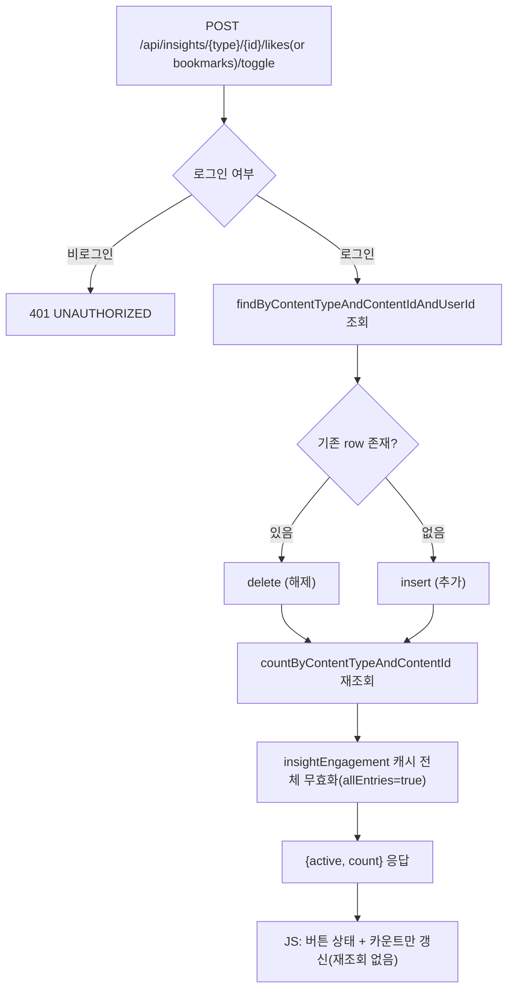

# Unit 3: 좋아요/북마크 — Compact Card (Delta of Unit 2)

> **Project**: dailyDevInsight | **Date**: 2026-08-05 | **문서 유형**: 1차 Compact Card
> **기준 문서**: `docs/02-design/features/insight-detail.md` (Unit 2) — 컨트롤러/서비스/캐시 정책 전체 공유. 여기서는 좋아요·북마크 고유 부분만 기록

## ① 목적

지식/뉴스 콘텐츠에 대한 좋아요·북마크 토글. 마이페이지 활동내역에서 북마크 목록 조회에도 사용됨.

## ② 관련 파일

- `InsightDetailRestController.toggleLike()` / `toggleBookmark()`
- `InsightDetailService.toggleLike()` / `toggleBookmark()`
- Entity: `InsightLike`, `InsightBookmark` (필드: `contentType`, `contentId`, `userId` 복합 유니크)
- Repository: `InsightLikeRepository`, `InsightBookmarkRepository`
- `MyPageService` — 마이페이지 활동내역(Unit 6)에서 북마크 목록을 재사용 (교차 참조)

## ③ 진입 엔드포인트

Unit 2 §3 참조 (`/api/insights/{type}/{id}/likes/toggle`, `/bookmarks/toggle`)

## ④ 핵심 호출 흐름

`findByContentTypeAndContentIdAndUserId` 존재 여부만으로 insert(좋아요/북마크 추가) 또는 delete(해제) — **엔티티 자체가 삭제되는 방식**, 별도 상태 플래그(active/inactive) 없음. 토글 후 `countByContentTypeAndContentId`로 최신 카운트 재조회.

### 처리 흐름도

## ⑤~⑥ 데이터/인증/트랜잭션/캐시

Unit 2와 완전히 동일 (같은 서비스 클래스, 같은 캐시 정책).

## ⑧ 패턴 특이사항

- 좋아요/북마크는 별개 엔티티지만 필드 구조·처리 로직이 완전히 동일 (복붙에 가까움) — 향후 공통 추상화 후보가 될 수 있으나 현재는 중복 구현 상태

## ⑨ 알아둘 점 / 리스크

- **이력 미보존**: 해제 시 row 자체가 삭제되어 "언제 좋아요를 눌렀다가 취소했는지" 감사(audit) 이력이 없음
- Unit 6(마이페이지 활동내역)이 이 데이터를 그대로 재사용하므로, 여기 스키마를 바꾸면 마이페이지도 영향받음

---

## Version History

| Version | Date | Changes |
|---|---|---|
| 0.1 | 2026-08-05 | 최초 작성 (1차 사이클 compact card, Unit 2 delta) |
| 0.2 | 2026-08-06 | 처리 흐름도(Mermaid) 추가 |
