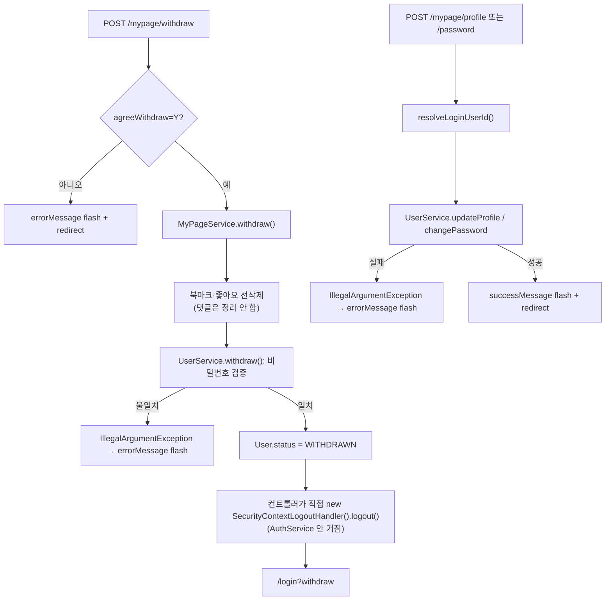

# Unit 6: 마이페이지 — Compact Card

> **Project**: dailyDevInsight | **Date**: 2026-08-05 | **문서 유형**: 1차 Compact Card
> Phase 1

## ① 목적

로그인 사용자의 프로필 조회/수정, 비밀번호 변경, 좋아요·북마크 활동내역 조회, 회원 탈퇴.

## ② 관련 파일

- `MyPageController` (`/mypage/**`, 엔드포인트 8개: GET 5 + POST 3)
- `MyPageService`, `UserService`(프로필 수정/비밀번호 변경/탈퇴 실제 검증 로직 위임)
- Repository: `InsightBookmarkRepository`, `InsightLikeRepository`(활동내역용, Unit 3 재사용), `DailyKnowledgeRepository`/`TechNewsRepository`(활동 항목 상세 조회)
- DTO: `MyPageActivityDTO`, `MyPageActivityItemDTO`
- `templates/mypage/{main,profile,password,activity,withdraw}.html`, `fragments/mypageNav.html`

## ③ 진입 엔드포인트

| Method | Path | 용도 |
|---|---|---|
| GET | `/mypage` | 메인(프로필 요약 + 활동 요약) |
| GET | `/mypage/profile` | 프로필 수정 화면 |
| GET | `/mypage/password` | 비밀번호 변경 화면 |
| GET | `/mypage/activity` | 좋아요/북마크 활동내역 화면 |
| GET | `/mypage/withdraw` | 탈퇴 화면 |
| POST | `/mypage/profile` | 프로필(이름/이메일) 수정 처리 |
| POST | `/mypage/password` | 비밀번호 변경 처리 |
| POST | `/mypage/withdraw` | 탈퇴 처리 |

## ④ 핵심 호출 흐름

1. 모든 GET 핸들러가 공통으로 `resolveLoginUserId()`로 인증 사용자 식별 (없으면 `IllegalArgumentException`)
2. 활동내역: `MyPageService.getMyActivity()` — 북마크/좋아요 각각 최근 30건(`PageRequest.of(0,30)`)을 `createdAt` 내림차순 조회 후, 콘텐츠 타입(NEWS/KNOWLEDGE)에 따라 원본 엔티티를 다시 조회해 DTO 구성 (N+1 가능성 있는 구조 — 활동 30건이면 최대 30번 추가 조회)
3. 탈퇴 처리(`processWithdraw`): 동의 체크(`agreeWithdraw=Y`) 확인 → `MyPageService.withdraw()` → **북마크·좋아요만 선삭제** 후 `UserService.withdraw()`(비밀번호 검증 포함 추정) → 성공 시 `new SecurityContextLogoutHandler().logout()`을 컨트롤러가 **직접 호출**(Unit 5의 `AuthService.logout()`을 거치지 않음) → `/login?withdraw`로 이동

### 처리 흐름도

## ⑤ 데이터/외부 연동

- 외부 연동 없음. `UserService`가 실제 이름/이메일 검증, 비밀번호 확인·변경, 탈퇴 로직을 담당(이번 조사 범위 밖 — 필요 시 별도 확인)

## ⑥ 인증·트랜잭션·캐시

- 트랜잭션: `MyPageService` **클래스 전체 `readOnly`**, 쓰기 메서드(updateProfile/changePassword/withdraw)만 개별 `@Transactional` 오버라이드 — Unit 1(`DailyInsightService`, 전체 readOnly)과 유사한 패턴이나 Unit 2(전체 쓰기)와는 다름
- 캐시 없음
- 인증 실패 시 `IllegalArgumentException`을 컨트롤러가 잡지 않고 그대로 흘림(Unit 2의 `ResponseStatusException` 패턴과도 다르고, Admin의 광범위 catch와도 다름) — 이 경우 Spring의 기본 에러 페이지로 감싸질 것으로 추정(착수 시 실제 응답 확인 필요)

## ⑦ 화면 요약

- 좌측 마이페이지 네비게이션(`mypageNav.html` fragment) 공통 사용, `currentMenu`로 활성 메뉴 표시
- 활동내역은 좋아요/북마크 탭 분리, 각 항목은 콘텐츠 제목/요약/썸네일/활동일시 표시

## ⑧ 패턴 특이사항

- **로그아웃 처리가 3번째로 다른 위치에서 구현됨**: 일반 로그아웃(`AuthController`→`AuthService`), 이 unit의 탈퇴 로그아웃(컨트롤러가 `SecurityContextLogoutHandler` 직접 생성) — 동일한 로그아웃 동작이 프로젝트 내 최소 2곳에 중복 구현되어 있음 (Unit 5에서 예상했던 부분이 실제로 확인됨)
- 예외 처리 방식이 여기서만 "그대로 흘림"(IllegalArgumentException 미포착) — Unit 2(REST, 명시적 상태코드), Admin(광범위 catch)과 또 다른 세 번째 패턴

## ⑨ 알아둘 점 / 리스크

- **탈퇴 시 댓글(`InsightComment`) 데이터는 정리 로직에 없음** — 북마크·좋아요만 선삭제하고 댓글은 그대로 남는 것으로 보임(작성자 `userId`가 탈퇴 후에도 유효한 FK로 남는지, 화면에 어떻게 노출되는지는 `UserService.withdraw()` 및 댓글 렌더링 로직 확인 필요 — 정밀화 시 우선 확인 대상)
- 활동내역 최근 30건 고정, 페이지네이션 없음 — `MVP_SCOPE.md`에 언급 없는 제약

---

## Version History

| Version | Date | Changes |
|---|---|---|
| 0.1 | 2026-08-05 | 최초 작성 (1차 사이클 compact card) — 탈퇴 시 로그아웃 중복 구현 확인, 댓글 정리 누락 가능성 발견 |
| 0.2 | 2026-08-06 | 처리 흐름도(Mermaid) 추가 |
