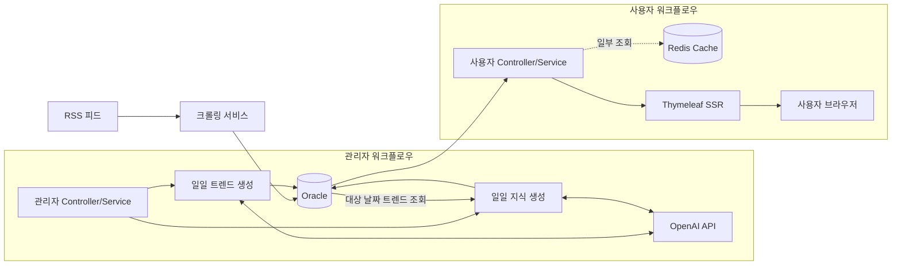
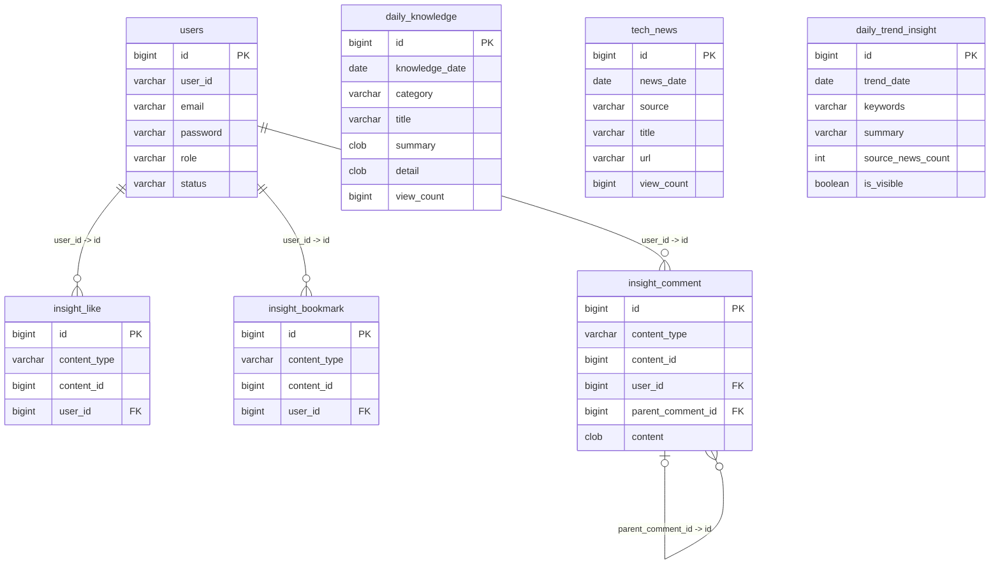
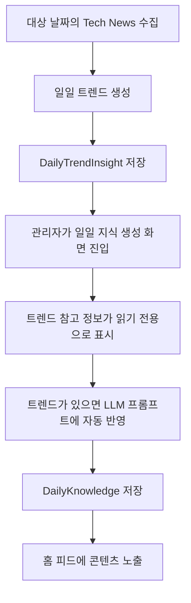

# DailyDevInsight 아키텍처

> 목적: Notion과 README는 읽기 쉽게 유지하고, 아키텍처 상세는 GitHub 문서로 분리한다.
> Notion 요약: https://app.notion.com/p/DailyDevInsight-RSS-AI-3b8806eb2ec081d6be8fd464578b8f4e

## 시스템 요약

DailyDevInsight는 개발 뉴스 RSS를 수집하고, Oracle에 저장한 뒤, OpenAI 기반 일일 지식과 일일 트렌드 콘텐츠를 생성해 사용자 화면과 관리자 화면에 제공하는 Spring Boot + Thymeleaf SSR 서비스다.

## 기술 스택

- Backend: Java 21, Spring Boot 3.2.0, Spring MVC, Spring Security, Spring Data JPA
- View: Thymeleaf SSR, Vanilla JavaScript, CSS
- Data: Oracle XE 21, Redis 7
- Crawling: RSS/XML 파싱, jsoup
- AI: OpenAI API, 로컬 개발용 Mock 클라이언트
- Build/Test: Gradle 8.2, JUnit 5

## 전체 흐름

## 계층 구조

- Controller는 요청을 받고 화면/응답 모델을 구성한다.
- Service는 비즈니스 규칙과 트랜잭션 경계를 담당한다.
- Repository는 영속성 접근을 분리한다.
- Entity는 저장 상태와 작은 도메인 상태 변경을 담당한다.
- 외부 RSS와 OpenAI 호출은 Service/Client 경계 뒤에 둔다.

관리자 화면도 DB에 직접 연결되지 않는다. 다른 화면과 마찬가지로 Controller와 Service 계층을 거쳐 데이터에 접근한다.

## 핵심 데이터 모델

주의할 점:

- `insight_like`, `insight_bookmark`, `insight_comment`는 `users`에 대한 실제 Oracle FK 제약을 가진다.
- `insight_comment.parent_comment_id`는 nullable 자기참조다. 최상위 댓글은 부모 댓글이 없다.
- `content_type + content_id`는 `daily_knowledge` 또는 `tech_news`를 가리키는 논리적 다형 참조다. 물리 FK는 아니다.
- `daily_trend_insight`는 `tech_news`와 저장된 FK 관계를 가지지 않는다. 날짜 기준 뉴스 조회 결과로 생성된 분석 결과만 저장한다.

## 일일 트렌드와 지식 생성 연결

일일 트렌드 기능은 서비스의 핵심 흐름을 연결한다.

대상 날짜에 트렌드가 없으면 일일 지식 생성은 트렌드 없이 계속 동작한다. 운영 흐름은 유지하면서, 가능한 경우에는 RSS 뉴스와 AI 지식 콘텐츠의 연결을 강화하는 방식이다.

## 실행과 배포 메모

- Oracle과 Redis는 `docker compose up -d`로 로컬 실행할 수 있다.
- 애플리케이션 기본 포트는 `9090`이다.
- OpenAI 키는 환경 변수로 주입하며 저장소에 커밋하지 않는다.
- 현재 공개 회원가입은 열려 있지 않다.
- OpenAI 호출은 관리자 트리거 경로에 있으므로 일반 방문자가 페이지 조회만으로 OpenAI 비용을 발생시키지는 않는다.

로컬 실행 방법과 환경 변수는 루트 [README](../../README.md)를 참고한다.

## 알려진 아키텍처 한계

- 부하 테스트와 Oracle 실행계획 검증이 아직 완료되지 않았다.
- 크롤링 중복 방지는 JVM-local 범위라 다중 인스턴스 배포를 커버하지 못한다.
- SSRF 방어 이후에도 DNS 리바인딩 잔여 위험이 남아 있다.
- LLM 타임아웃, 재시도, 프롬프트 인젝션 방어는 후속 작업이 필요하다.
- 수동 AI 생성은 트렌드 참조 ID는 저장하지만, 트렌드 본문 전체를 불변 스냅샷으로 저장하지 않는다.
